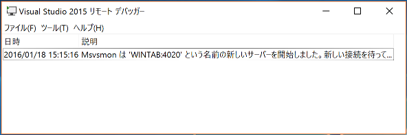
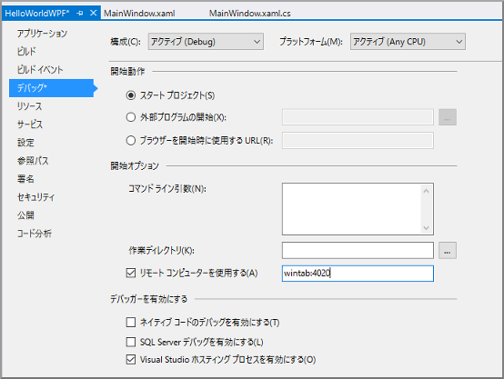
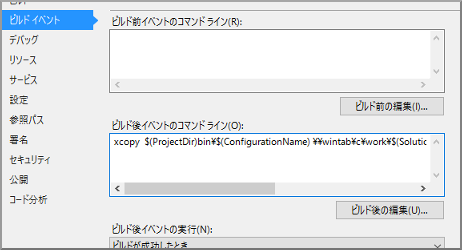

Windows10タブレットで運用するWPFアプリケーションの作業をしています(UWPではなくWPF)。
いちいちビルド結果をタブレットにコピーしたり、ましてやタブレットにVisual Studioを入れるというのはさらに面倒くさいので、手元の開発環境での動作確認と、タブレットでの動作確認を切り分けて行えるようにしています。

## 基本

### タブレットにリモートデバッガをインストール

まず、[Remote Tools for Visual Studio 2015 Update 1](https://www.microsoft.com/ja-jp/download/details.aspx?id=49986)をタブレットにインストールします。

インストール後、Remote Debuggerを起動するとデフォルトだとTCPの4020で待ち受け状態になります。(開発環境のあるPCからネットワーク的にアクセスできる状態になっている必要があります)

### Visual Studioプロジェクトの設定

次に、開発環境のあるPCで、プロジェクトの設定をします。
まず、プロジェクトのプロパティ-デバッグの設定で、「リモートコンピュータを使用する」に、タブレットのIPアドレス(もしくは名前で解決できるのであればそれでも可)とポート(4020)を指定します。

次に、ビルドイベントの「ビルド後イベントのコマンドライン」に下記を指定します。
ソリューションは、c:\work\HelloWorldWPFにおいてあることを想定しています。
あとタブレット側はcドライブ自体が共有でアクセスできるようにしてあります。

    xcopy $(ProjectDir)bin\$(ConfigurationName)\ \\wintab\c\work\$(SolutionName)\$(ProjectName)\bin\$(ConfigurationName) /e /c /h /y /d /i

ちょっとごちゃごちゃしていますが、「ビルドが完了したらバイナリをタブレットの同じ位置にコピーする」と言うことをしています。
というのも、どうも開発環境でのディレクトリ構成と同じパスになっていないとダメみたいで、ビルド結果が「c:\work\HelloWorldWPF\HelloWorldWPF\bin\Debug」に出力されるようになっていれば、タブレット側も同じパスじゃないとダメってことです。
ビルド後コマンドも、中途半端にマクロを使うことになっていますが、最後に\がつくとxcopyがエラーになるのでこういうことになっています。

要は、「開発環境と同じパスにビルド結果が入ればいい」と言うことなので、コマンドプロンプトでちゃんとそのようにコピーされるコマンドを確認してから貼り付けてもいいですし、何か別のツールが実行されるようにしてもいいですね。

ここまで設定した上で、一度ビルドをしてみます。
タブレット側のディレクトリにDebugの内容が入っていればOKです。
デバッグ実行すると、タブレット側にウインドウが開きます。

この状態で、開発環境にちゃんとデバッグの出力がされますし、ブレークポイントもちゃんと機能します。画面が出ているのがタブレットなだけで、基本的なことは全部同じです。

まとめると、

*   リモートデバッガのインストール
*   プロジェクトでリモート実行するように設定
*   ビルド結果を開発環境と同じ構成のパスにコピー

という段取りになります。

## 実用的な設定

今回のプロジェクトの場合、常にタブレットでデバッグする必要はないので、通常のデバッグは開発環境で行い、タブレットでテストしたいときだけリモートデバッグする、という風な使い方になるので、ちょっと工夫しています。

### ビルドの出力先を基準が固定されたところにする

「c:\buildwork\$(SolutionName)\$(ConfigurationName)」とかに出力されるようにする、ということにすれば、開発環境、タブレット環境ともにc:\buildworkだけ作っておけば、ビルドとxcopyが面倒を見てくれます。

### 構成マネージャで"Remote"など別の構成を作る

標準では、DebugとReleaseの2つの構成がありますが、そこに"Remote"という名前の構成をDebugをコピーして作成します。そして、プロジェクトのプロパティでRemote構成の場合はリモートでデバッグするように設定しておきます。
そうすると、Debug構成の時は開発環境で、Remote構成を選んだらタブレットで動くようになります。

### ビルド後のスクリプトを修正

コピーするときのスクリプトに「Remote構成の時は」という条件を入れておかないと、タブレットが起動してないとxcopyがエラーになってうざいですね。

    if "$(ConfigurationName)" == "Remote" (
    xcopy ...
    )

こんな感じに設定しておいて、普段はDebug、タブレットで動かすときはRemoteを使えば便利です。

複数メンバーで同じソリューションやプロジェクトを使う場合などは、みんな同じディレクトリ構成が要求されるので事前の取り決めや準備が必要、もしくは各自でプロジェクト設定を変更する、などの手間が出るかもしれません。
あと、タブレットの共有設定が自由にできるかどうかなども問題もあるかもしれません(借りている端末や実機などだといろいろ設定を触れないかもしれないですからね)。

とはいえ、逐一バイナリをコピーして......というのも手間ですし、ステップ実行や開発環境でのモニタリングができる状態での検証は生産効率も上がりますよね。