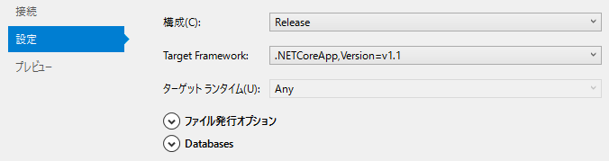

あるアプリのサーバー側を.NET Coreで作ってAzureにホストしているのですが、.NET Coreのバージョンを1.0から1.1にしてみました。Visual Studioは2015です。

## インストール

[https://www.microsoft.com/net/download/core](https://www.microsoft.com/net/download/core)

ここで、.NET Core 1.1 SDK - InstallerとVisual Studio 2015 Tools (Preview 2)をダウンロードしてインストール。

## ファイルの書き換えとパッケージのアップデート

global.jsonのversionを書き換え。

    {
      "projects": [ "src", "test" ],
      "sdk": {
        "version": "1.0.0-preview2-1-003177"
      }
    }

project.jsonの下記2カ所。

    "Microsoft.NETCore.App": {
      "version": "1.1.0",
      "type": "platform"
    },

    "frameworks": {
        "netcoreapp1.1": {

Package Manager Consoleで

    PM> Update-Package

そうすると、
変更前

    {
      "title": "Hoge",
      "version": "1.0.0",
      "dependencies": {
        "Microsoft.NETCore.App": {
          "version": "1.0.1",
          "type": "platform"
        },
        "Microsoft.AspNetCore.Server.IISIntegration": "1.0.0",
        "Microsoft.Extensions.Configuration.EnvironmentVariables": "1.0.0",
        "Microsoft.Extensions.Configuration.FileExtensions": "1.0.0",
        "Microsoft.Extensions.Configuration.Json": "1.0.0",
        "Microsoft.Extensions.Logging": "1.0.0",
        "Microsoft.Extensions.Logging.Console": "1.0.0",
        "Microsoft.Extensions.Logging.Debug": "1.0.0",
        "Microsoft.Extensions.Options.ConfigurationExtensions": "1.0.0",
        "Microsoft.AspNetCore.Cryptography.KeyDerivation": "1.0.0",
        "Microsoft.EntityFrameworkCore.Tools": "1.0.0-preview2-final",
        "Microsoft.AspNetCore.Mvc": "1.0.1",
        "Microsoft.AspNetCore.Server.Kestrel": "1.0.1",
        "Microsoft.EntityFrameworkCore": "1.0.1",
        "Microsoft.EntityFrameworkCore.SqlServer": "1.0.1",
        "Microsoft.AspNetCore.StaticFiles": "1.0.0"
      },
      (後略)

↓

    {
      "title": "Hoge",
      "version": "1.0.0",
      "dependencies": {
        "Microsoft.NETCore.App": {
          "version": "1.1.0",
          "type": "platform"
        },
        "Microsoft.AspNetCore.Server.IISIntegration": "1.1.0",
        "Microsoft.Extensions.Configuration.EnvironmentVariables": "1.1.0",
        "Microsoft.Extensions.Configuration.FileExtensions": "1.1.0",
        "Microsoft.Extensions.Configuration.Json": "1.1.0",
        "Microsoft.Extensions.Logging": "1.1.0",
        "Microsoft.Extensions.Logging.Console": "1.1.0",
        "Microsoft.Extensions.Logging.Debug": "1.1.0",
        "Microsoft.Extensions.Options.ConfigurationExtensions": "1.1.0",
        "Microsoft.AspNetCore.Cryptography.KeyDerivation": "1.1.0",
        "Microsoft.EntityFrameworkCore.Tools": "1.0.0-preview2-final",
        "Microsoft.AspNetCore.Mvc": "1.1.1",
        "Microsoft.AspNetCore.Server.Kestrel": "1.1.0",
        "Microsoft.EntityFrameworkCore": "1.1.0",
        "Microsoft.EntityFrameworkCore.SqlServer": "1.1.0",
        "Microsoft.AspNetCore.StaticFiles": "1.1.0"
      },
      (後略)

アップデート後は、Microsoft.EntityFrameworkCore.Tools以外は1.1.xになっています。

## EntityFramework Core関連

Package Manager Consoleで

    PM> Update-Package Microsoft.EntityFrameworkCore.Tools -Pre

これで、

    "Microsoft.EntityFrameworkCore.Tools": "1.1.0-preview4-final"

アップデートされます。

## Azureへの発行

ちょっとはまってしまったのですが、発行時にTargetFrameworkをちゃんと1.1を選んでおかないと、pubxmlの設定が1.0のままになるらしく、サーバーに発行する段階でエラーが出ます。

