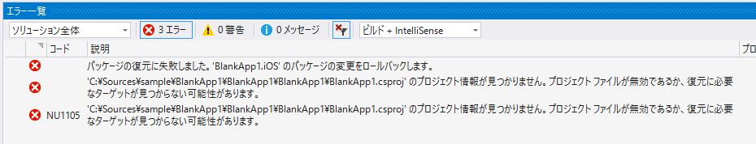
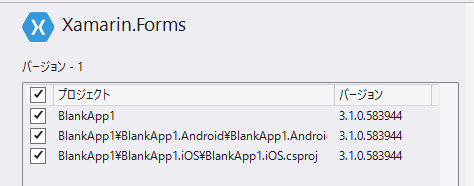
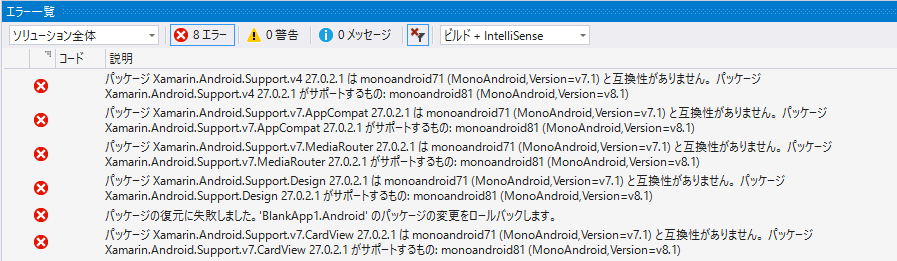
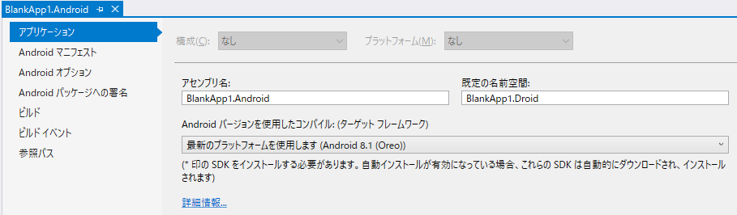
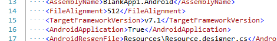
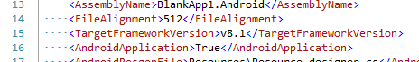
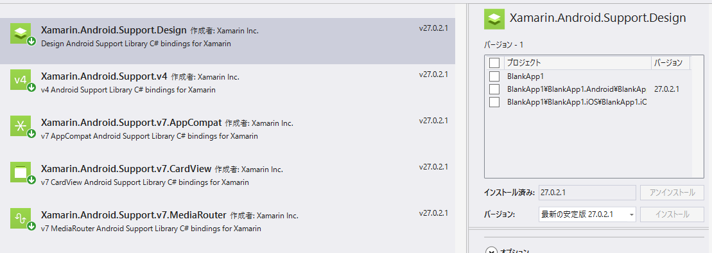

Prism Blank App(Xamarin.Forms)でXamarin.Formsのアプリを作ろうと思ったわけですが、Xamarinが2.5だったりAndroid関連のライブラリが古いので、まずはその辺のアップデートを行います。

---

新しいプロジェクトの作成からプロジェクトができたらまずやることは「VisualStudioを終了」。で、改めてソリューションを開いてからじゃないと、Xamarinのアップデートでエラーが出ます。

Xamarin関連はなんか基本の部分が変わるときは再読み込みが必要っぽいです。

開き直したら、今度はXamarinだけのアップデートをします。
無事3.1になりました。

次にAndroid関連のアップデートをしますがエラーが出ます。

 

でもこれはソリューションの再読み込みでは解決しません。

v27はAndroid v7.1のSDKではだめですよってことなんですが、Androidプロジェクトのプロパティを確認しても、ターゲットプラットフォームは「最新のプラットフォームを使用します(Android 8.1(Oreo))」となっています。

しかしこれが罠で、csprojをエディタで開くと、TargetFrameworkVersionはv7.1になっているのです。

v8.1に書き換えるか、プロパティエディタの場合は、8.1にして保存すればいいでしょう。

無事アップデートできました。

* Visual Studio 2017 ver 15.7.4
* Prism Template Pack 2.0.9

※ Visual Studio for Macには、「Prism Template Studio and Developer Toolkit」というのが出てるんですよね。

`youtube: https://www.youtube.com/watch?v=An3eiue4KIw`

なんかプロジェクト作成ウィザードでいろいろ初期設定ができるみたいですね。