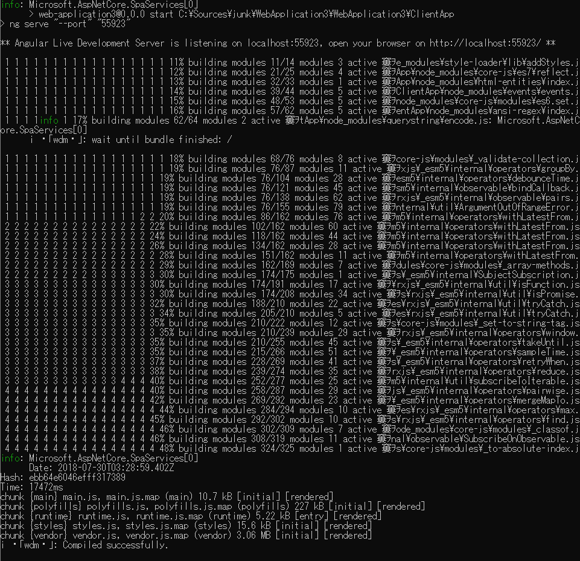
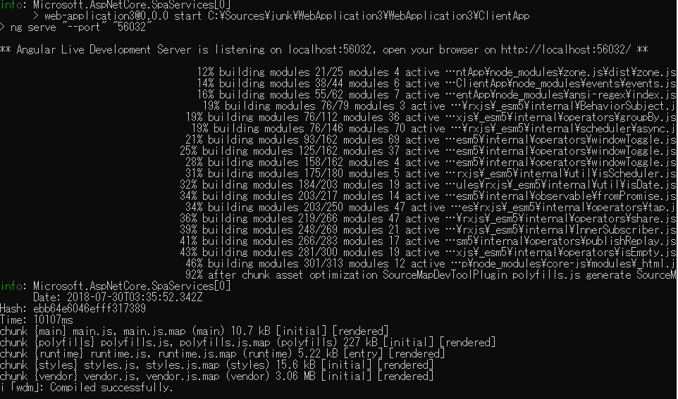

Visual Studio 2017で、ASP.NET Core+Angularで作ったアプリケーションを、Kestrelで実行すると、コンソールの表示があれこれ文字化けします。



コンソールの文字コードの原因だと思われるので、Program.csのMainに、

```csharp
Console.OutputEncoding = System.Text.Encoding.UTF8;
```

こんな風にしておくと、



比較的ましな表示になります。
ただ、進捗表示部分はちょっとずつ右に寄っていきます。

まあ、常時見るものじゃないですし、最低限何かあったときに読めればいいぐらいですから、文字化けが気になるようなら、という備忘録として。