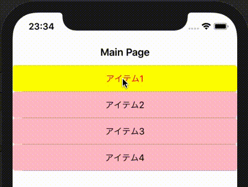

放浪軍師さんの[コントロール配列の呪いを解きたい](https://www.gunshi.info/entry/2018/09/09/221922)を見て、なんか頑張ってる姿に触発されたので、自分だったらこんな感じかなぁと言うのを試してみました。

Xamarin.Forms + Prism + ReactiveProperyのそれぞれ最新状態です。

## 構成

* MainPage.xaml : View
* MainPageViewModel : ViewModel
* Itemクラス : リスト項目のmodel
* ToggleButtonクラス : Buttonに選択状態のプロパティを拡張したもの

項目のモデルは名前と選択状態だけ保持しておいて、表示に関する制御はviewが行います。
リストはサンプルなのでViewModelで生成してしまっています。

## MainPage.xaml

ポイントは、

* ボタンのCommandは、親となるContentPage(x:Name="Base")のBindingContext(=MainViewModel)にあるコマンドを指定する
* ボタンのテキストと背景の色は、StyleのTriggerを使って、ToggleButtonのIsSelectedプロパティによって変化させる

の2つです。
(サンプルで手抜きしてるので、ToggleButtonのコードがMainPageViewModelと同じファイルに書いてあります)

```xml
<?xml version="1.0" encoding="utf-8" ?>
<ContentPage xmlns="http://xamarin.com/schemas/2014/forms"
             xmlns:x="http://schemas.microsoft.com/winfx/2009/xaml"
             xmlns:viewmodels="clr-namespace:BlankApp6.ViewModels"
             x:Class="BlankApp6.Views.MainPage"
             x:Name="Base"
             Title="Main Page">

  <ContentPage.Resources>
    <ResourceDictionary>
      <Style x:Key="ItemSelectedStyle" TargetType="viewmodels:ToggleButton">
        <Setter Property="TextColor" Value="Black"/>
        <Setter Property="BackgroundColor" Value="Pink"/>
        <Style.Triggers>
          <Trigger TargetType="viewmodels:ToggleButton" Property="IsSelected" Value="True">
            <Setter Property="TextColor" Value="Red"/>
            <Setter Property="BackgroundColor" Value="Yellow"/>
          </Trigger>
        </Style.Triggers>
      </Style>
    </ResourceDictionary>
  </ContentPage.Resources>

  <ListView ItemsSource="{Binding Items}">
    <ListView.ItemTemplate>
      <DataTemplate>
        <ViewCell>
          <viewmodels:ToggleButton Command="{Binding BindingContext.ItemTapped, Source={x:Reference Base}}"
                                   CommandParameter="{Binding}"
                                   Text="{Binding Name}"
                                   IsSelected="{Binding IsSelected}"
                                   Style="{StaticResource ItemSelectedStyle}"/>
        </ViewCell>
      </DataTemplate>
    </ListView.ItemTemplate>
  </ListView>

</ContentPage>
```

## MainViewModel

ポイントは特にないです。
ReactiveCommandはタップしたItemが引数としてきますので、それに対して操作をします。

```csharp
public class MainPageViewModel
{
    public ObservableCollection<Item> Items { get; }
    public ReactiveCommand<Item> ItemTapped { get; }

    public MainPageViewModel()
    {
        Items = new ObservableCollection<Item>
        {
            new Item { Name = "アイテム1" },
            new Item { Name = "アイテム2" },
            new Item { Name = "アイテム3" },
            new Item { Name = "アイテム4" }
        };

        ItemTapped = new ReactiveCommand<Item>();
        ItemTapped.Subscribe(x =>
        {
            x.IsSelected = !x.IsSelected;
        });
    }
}
```

## Itemクラス

すごく単純化して、表示する名称と選択されたかどうかだけ管理しています。
多分裏側の処理では、これが選択されてるかどうかでルーレットの対象になるかどうか決める感じですかね。
表示に関する部分は、viewに任せてあるので、こいつはどうやって表示されるかは気にしません。

```csharp
public class Item : BindableBase
{
    public string Name
    {
        get => name;
        set => SetProperty(ref name, value);
    }
    private string name;

    public bool IsSelected
    {
        get => isSelected;
        set => SetProperty(ref isSelected, value);
    }
    private bool isSelected;
}
```

## ToggleButtonクラス

ButtonにIsSelectedという選択状態を管理するbool型のプロパティを追加しただけのコントロールです。
この追加したプロパティとItemのIsSelectedをbindingして使うことになります。
で、viewに書いてあるstyleトリガがそのIsSelectedを見て色を変える、ということです。

```csharp
public class ToggleButton : Button
{
    public static readonly BindableProperty IsSelectedProperty =
        BindableProperty.Create(
            "IsSelected",
            typeof(bool),
            typeof(ToggleButton),
            false);

    public object IsSelected
    {
        get => GetValue(IsSelectedProperty);
        set => SetValue(IsSelectedProperty, value);
    }
}
```

## 実行結果

iPhoneシミュレータでの動作です。

