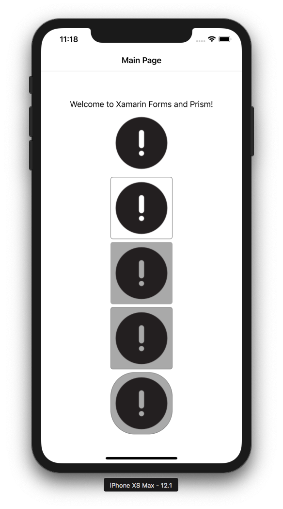

もう3.4がリリースされました。

[Xamarin.Forms 3.4.0](https://developer.xamarin.com/releases/xamarin-forms/xamarin-forms-3.4/3.4.0/)

* 3.0 : 6/27
* 3.1 : 8/2
* 3.2 : 10/3
* 3.3 : 10/17
* 3.4 : 11/15

チェックしておきたいのは、ImageButtonです。
普通のButtonだとイメージを指定してもテキストの横に表示されるため、単なる画像ボタンとしては使いにくいところがありました。
なので、何かと自前でやることになったのですが、これぐらいよく使うものであれば、標準で対応してくれると書き方がぶれにくくなっていいですね。

## ImageButton

* Source
* BackgroundColor
* BorderColor
* BorderWidth
* CornerRadius

この辺のプロパティを使って、枠付き枠なし、角丸ありなし、とかできますね。
あと、IsPressedとstyle triggerを使えば、押したときのスタイルを指定できますから、なんか複雑なボタンじゃなければこれで十分使えそうです。

```xml
<StackLayout HorizontalOptions="CenterAndExpand" VerticalOptions="CenterAndExpand">
  <Label Text="Welcome to Xamarin Forms and Prism!" />
  <ImageButton Source="alertcircle"
               HorizontalOptions="Center"/>
  <ImageButton Source="alertcircle"
               HorizontalOptions="Center"
               BorderColor="Gray"
               BorderWidth="1"/>
  <ImageButton Source="alertcircle"
               HorizontalOptions="Center"
               BackgroundColor="DarkGray"/>
  <ImageButton Source="alertcircle"
               HorizontalOptions="Center"
               BackgroundColor="DarkGray"
               BorderColor="Gray"
               BorderWidth="1"/>
  <ImageButton Source="alertcircle"
               HorizontalOptions="Center"
               BackgroundColor="DarkGray"
               BorderColor="Gray"
               BorderWidth="1"
               CornerRadius="50"/>
</StackLayout>
```

