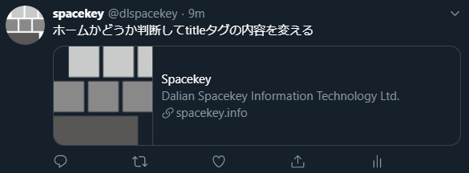
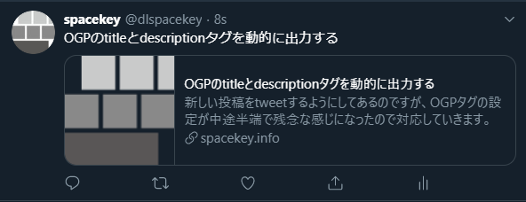

新しい投稿をtweetするようにしてあるのですが、OGPタグの設定が中途半端で残念な感じになったので対応していきます。



<!--more-->

## 仕様

1. "Spacekey"になっている所には、投稿のタイトルが出るようにする
2. "Dalian Spacekey(以下略)"になっているところは、要約を出す

## 実装

* meta name="og:title"は、content="{{ .Title }}
* meta name="og:description"は、content="{{ .Summary }}

とそれぞれ出力するようにhead.htmlを書きかえるだけですが、descriptionの方は別の所にも工夫が必要です。

/layouts/partials/head.html


``` html
  <meta name="og:title" content="{{ .Title }}" />
  <meta name="og:description" content="{{ .Summary }}" />
```

## 要約(Summary)

### configでの対応

Hugoは記事から自動的に要約を生成してくれますが、いわゆる英語のワード単位で切り出してくるため、日本語になるととんでもない量を切り出してきます。  
一応その辺も考慮されていて、config.tomlに下記のように設定すると短くしてくれます。

```toml
hasCJKLanguage = true
```

C中国語、J日本語、K韓国語の場合要約の切り出し方が変わりますので、一応これをセットしておきます。
ただし、切り出し範囲が極端に短くなるのと、文の途中で切れることもあります。

### 記事での対応

あとは、記事の方に

~~~
<!--more-->
~~~

と入れておくと、そこまでを要約としてくれるので、markdownファイルを書いたときに、要約として出したいところに入れるようにしておきます。

```markdown
---
title: "ホームかどうか判断してtitleタグの内容を変える"
date: "2019-09-26 1:00:00"
tags: ["Hugo"]
---

titleタグが出力出来ていなかったので対応していきます。

<!--more-->
```

## 出力結果

```html
<meta name="og:title" content="ホームかどうか判断してtitleタグの内容を変える" />
<meta name="og:description" content="titleタグが出力出来ていなかったので対応していきます。" />
```

こういう感じで出力されるようになりました。  

※この記事のやつだけど一応修正出来たよってことで…


