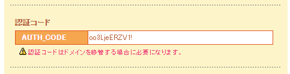
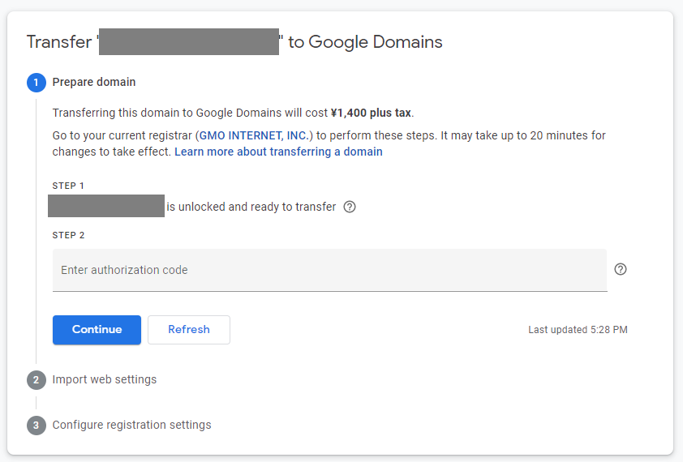
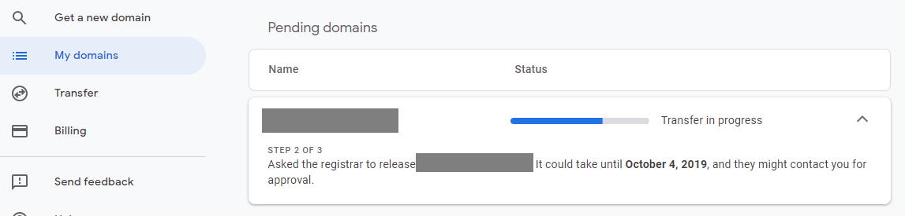

ムームードメインで扱っているドメインをGoogle Domainsに移管してみました。

<!--more-->

長らくロリポップでWordpressを使ってサイトとメールを使ってきましたが、サイトジェネレーターがしっくりきたのですべてNetlifyに移管しました。 
メールについても、普段はgmailで事足りていて、各ドメインのメールはもっぱらスパムメールの受信だけだったので、もうgmailへの転送で十分だろうということでドメインのメールサーバーもやめることにします。さらにロリポップを使わないのであれば、ドメインの管理も別のムームードメインである必要は特にないので、これを機会にGoogle Domainsに移管してみます。

## 手順

1. [ムームー]Whois情報を本人情報に変える
2. [ムームー]変更確認のメールにあるURLにアクセスして変更承認する
3. [ムームー]ドメインの情報で認証コードを確認する
4. [Google]移管手続きをする
5. [Google]料金を支払う
6. [ムームー]移管申請の確認メールが来るので承認する
7. [Google]移管完了のメールが来る

## 1.[ムームー]Whois情報を本人情報に変える

Whois情報を匿名状態にしている人が多いでしょうから、まずこの作業が必要です。

## 2.[ムームー]変更確認のメールにあるURLにアクセスして変更承認する

Whois情報に登録されているメールアドレス宛に、情報変更するかどうかの確認メールが来ますので、そこに書かれているリンクをクリックすると変更完了です。  
そのあとさっきの画面を見ると、下記のようになっているはずです。

## 3. [ムームー]ドメインの情報で認証コードを確認する

ドメイン一覧で、対象になるドメインをクリックするとドメインの詳細情報が出るので、認証コードを探してメモします。

とりあえずムームー側の作業はここまでです。

## 4. [Google]移管手続きをする

Google Domainsに行ってTransferをクリック、対象となるドメイン名を入力します。

authorization codeに手順3でメモしたコードを入力してContinue。

もしムームー側のネームサーバーで何か設定していたら、「こんな設定があるけどインポートするかい？」って聞いてくるので、とりあえずインポート。  
ただ、別にあとからてで入れられるぐらいのものだったらインポートするほどのことではないです。

いくらかかりますよという情報と、Whois情報を匿名にするか、自動更新にするかを聞いてきますので選びます。  
値段については、[ドメイン移管の要件](https://support.google.com/domains/answer/9003299?ref_topic=9003137)に説明がありますが、1年分さらに延長する料金のことなので、手数料ではないです。画像を見てもらったらわかるとおり、ドメインの終了期間が2020年から2021年になるだけですので無駄なお金ではないです。

## 5. [Google]料金を支払う

次に進むと支払い画面になるのでよしなにします。
支払いが完了すると移管中の表示が出ますので、とりあえずこれでGoogle側の手続きは完了です。

## 6. [ムームー]移管申請の確認メールが来るので承認する

移管申請していいかどうかの確認メールが、ムームーから来ます。  
一応いろんな所の説明では、「何日かかかる」ということになってますが、今回の場合1時間かかってないと思います。
リンクをクリックして確認します。

## 7. [Google]移管完了のメールが来る

## 完了

これで完了です。  
ムームーDNSとはNetlifyにドメインを向けるときの設定が違うのでそれを調整すればOKでした。

UIはGoogle Domainsの方が見やすいです。1年のドメイン維持費もちょっとだけ安くなりました。  
もう今後はGoogle Domainsで全部管理すればいいかなぁという感じです。

ただこの話には後日談があります。  
すごいめんどくさい状況に陥ってしまうことになりました。  
まだ解決してないので、解決次第記録したいと思います。