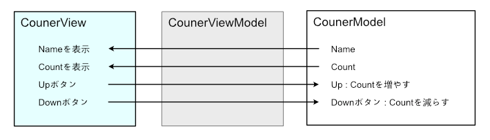
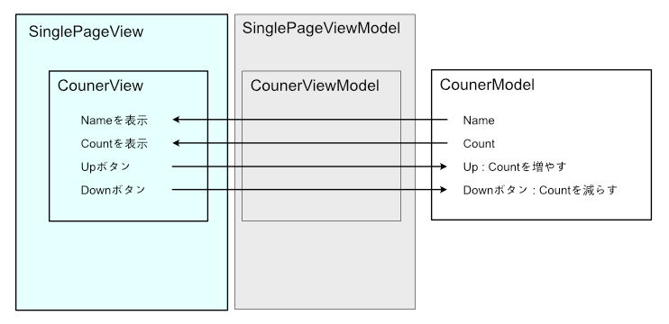
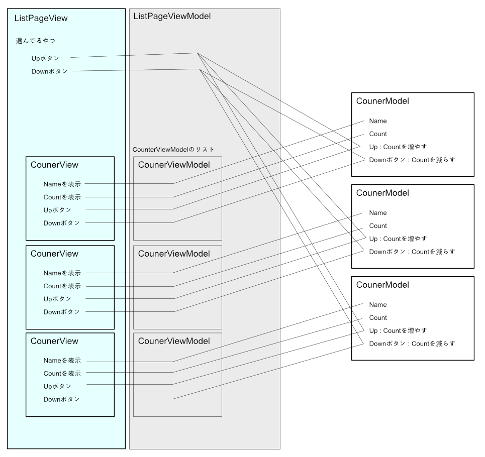

[放浪軍師さん](https://twitter.com/roamschemer)が、Xamarinで困ってたのを見つけたので、ちょっとXamarinリハビリのためサンプルを作ってみました。

<!--more-->



困っているポイントとしてはここに書かれている状況のようで、これをベースにじゃあどうするか？っていうのを考えてみたんですが、私自身ちょっと手詰まりな感じがしました。頑張れば思った動きをするようにはなるんだと思いますが、なんか「本来やりたいこと」とかけ離れたコードを書き続けないといけない苦行になってしまいそうです。

私も何年か前にWPFのプロジェクトをやることになり、MVVMってなんなのか、どう書いておくといいのかとか、かなり試行錯誤して、なんとなくそれっぽいコードがかけるようになり、実際うまく書けたケースでは、やりたいことがコードとして読めるし、修正や変更がしやすいものになっている気がします。  
(ただ、要求に合わせてものが複雑になってくると、境目がごちゃごちゃしはじめますが…)

さてじゃあ、これが「同じことをする機能がネストしている、別の画面に現れる」みたいなケースをMVVM的に解決する場合どうしたらいいのか？という問いだとして、それに対してのシンプルな答えを私なりに書いてみました。



Xamarin.Forms + Prism + ReactivePropertyで作ってあります。この組み合わせは、私にとって何か作るときの鉄板です。  
iOSしか入ってませんが、いらないものを消したぐらいで、プラットフォームに関係する部分はAndroidでも一切触る必要はないです。

## 簡単な解説

コードを書いてるときは、念仏のように「Viewがやること、ViewModelがやること、Modelがやること…」と心の中でつぶやき続けます(まじで)。

1. Viewがユーザーに見せて、操作させるべきものを用意します。
2. View作ってるときは裏側がどうなってるべきかなんてことは忘れましょう。なにが見えてないといけないかだけ気にしとけばいいです。
3. Viewが必要としてるものを、そいつに挿し込まれることになるViewModelで用意してあげます。
4. ViewModelの立場では、Viewがいると言ってるものは、どこからとってきてどういう形にしてやればいいかだけ考えましょう。決して元々ないものを勝手に作ったらいけません。
5. 必要なデータやそのデータをどう操作するかとか、大事な部分はModelにあるはずです。

Viewについては、XAMLで書いてるってこともありますし、「表示とユーザーの操作を受け付ける以外は処理を書くな」的な原則を守っていれば結構理解しやすいんですが、ViewModelの役割はMVVMに慣れてないうちはどうしても曖昧になりがちで、気がつくとViewModelに延々と何か書いていたりします。

以前にその辺の区別がよくわからなくなっちゃった人から聞かれたときは、「レストランのウエイター/ウエイトレスが、お客さんからの注文を自分で調理してユーザーに出さないでしょ」という説明をしたら腑に落ちてました。ウエイター/ウエイトレスの役割は、厨房に注文を伝えてできたものをお客さんに運ぶことなので、そこで料理が発生したら変なわけです。また、できたものを粛々とお客さんに持って行く仕事なわけですが、別に単に料理がスルーしていくわけじゃなく、箸や小皿、追加の調味料なんかは厨房の作業と関係なく、必要なものを付け加えたりして持ってくわけです。

さてじゃあこのサンプル、どういう段取りで作っていったかというと、

* カウンターを作る
    * 名前とカウンタ、増やす/減らす
* メインのモデルを作る
    * 状態を保持するクラスを用意して、カウンターを管理する
    * こいつはシングルトンにして必要なところにDIで使い回す
* カウンターの操作をするView(コントロールと思ってもいいです)を作る
    * カウンターの操作に必要なViewModelを用意する
* カウンターが一個だけあるページを用意する(SinglePageView)
    * カウンターコントロールを1個だけ使いたいのでぽつんと配置する
    * そのコントロールが必要なViewModelを、ページのViewModelで用意して渡してやる
* カウンターがリストで表示されるページを用意する(ListPageView)
    * モデルが持ってるカウンターのリストをとってきて、それ全部のViewModelを作って供給してやる
    * SinglePageでやってることを配列で繰り返してるだけ

っていうことです。

## CounterView

CounterViewはこんな感じになります。
ViewModelは、コンストラクタでもらったカウンタとViewを仲介してるだけです。
このViewModelについては、Prismの自動でViewとViewModelをバインドする機能は使いません。
なのでApp.xaml.csでコンテナにも登録しません。
自分で面倒を見ます。

## SinglePage

単一機能として使う場合はこうなります。
ページのViewModelがViewに提供するのは、カウンタそのものではなく「カウンタのViewModel」です。
なので、裏からカウンタをとってきたら、CounterViewModelに突っ込んでViewが持って行けるようにするわけです。

## ListPage

リストでカウンターを並べる場合はこうなります。
ページのViewModelがViewのCollectionViewに提供するのは、カウンタそのものではなく「カウンタのViewModelのリスト」です。
なので、裏からカウンタのリストをとってきたら、それを一個ずつCounterViewModelに突っ込んで、それをリストとしてCollectionViewのソースになるわけです。
CollectionViewの中はCounterViewがぽつんとあって、リストから供給されるCounterViewModelを待ってます。
また、「親が操作する」に当たる部分は、CounterViewのUIとは別のものなので、それについてはページのViewModelがカウンタとの仲介役になっています。

## まとめ

さてこれで、

* 親で操作したら、対象の子の状態が変わる。
* 子で操作したら、対象の子の状態が変わる。
* 両方が見てるものは同じデータなので、当然相互に同じ状態を共有してる

という動きになります。

View同士が相談して何か始まるのではなく、Viewが自分のじゃないViewModelに何かしてもらうのでもなく、Viewみんながそれぞれ自分の担当のViewModelに必要なものを用意してもらい、それぞれが決められたことを忠実にこなしているだけで、なぜかみんなが協調動作してるように見えるというやつになりました。

実際のプログラムだとなかなかこんなに見通し良くなりませんが、原則としてはすべてがViewModelを持っていてそれを介して何かしてるわけですから、バチッと決まったときは結果としてすごいきれいなコードになり、機能やデータの動きがわかりやすいものができるのがMVVMのすごいところです。まあその裏返しとして、組み合わさる瞬間までを見通してないと"もれなく"ひどい結果になってしまうのが扱いづらいところでもありますね。
