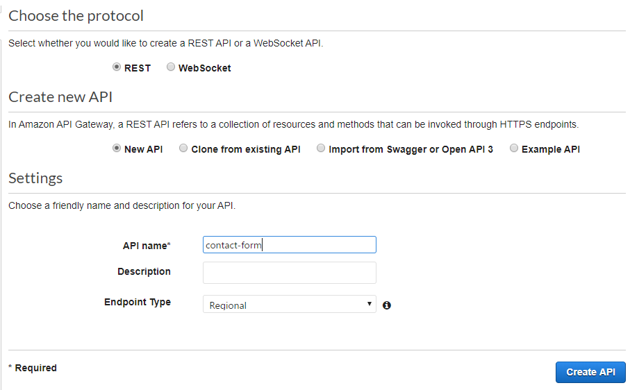
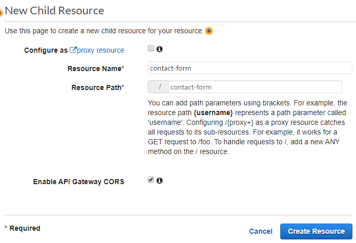

あるお客さんのサイト群の管理を引き受けることになり、そのうちの1つのサイトがWordpressなんだけどほぼスタティックなサイトだったので、Wordpressのサイトとしてまるごと移管するよりか、Vue(Nuxt)を使ってほぼスタティックなサイトにしてNetlifyにホスティングしたほうが軽いし、当面無料でいけそうということでサクッと作り替えました。

ただ、お問い合わせフォームが、単に管理者向けにメールするだけでなく、問い合わせ者にも送るようになっていたので、その部分の裏側だけはAWSに作ることにしました。

<!--more-->

## Pythonスクリプト

Pythonはこんな感じにしておきます。



メールサーバーに接続して、問い合わせ者と管理者にそれぞれメールを送って終わり。入力値のチェックも省いていますし、何かエラーが出てもただ失敗した、となるだけの単純なものです。

POSTで下記のようなjsonを受け取ることを前提としています。

```json
{
    "name": "name",
    "furigana": "furigana",
    "company": "company",
    "email": "email",
    "tel": "tel",
    "category": "category",
    "content": "content"
}
```

メールサーバーなどの設定は、環境変数から取得する前提です。

## Lambda

LambdaをPythonで新規作成するだけです。

名前を入れてPython3.8を選択。


スクリプトをエディタに貼り付ける。


環境変数を下記のように設定。


タイムアウトがデフォルト3秒だと、メールサーバー接続から送信完了が終わらないので、30秒ぐらいにしとく。


## API Gateway

Lambdaだけだと外から呼べないので、実行してくれる役割になるAPI Gatewayを設定します。

コンソールでAPI Gatewayに行って、Create New。  
REST APIを選択。


API nameを何か入れてCreate API。



Create Resource。


Resource Nameを入力。  
これは、POSTするときのURLの最後に当たる部分の名前です。  
「https://.../stage/<ここ>」



Create Method


ツリーのところでPOSTを選んでから、Lambdaを作ったリージョンを選んで、作ったLambdaの名前を入力します。  
オートコンプリートが効くので、一部入力すると選べます。


そのあと、ActionsからEnable CORSを選んでEnable。  
必要であれば「Access-Control-Allow-Origin」に呼び出し元のトップレベルドメインまでを入力しておくと、そのサイトのコードからのみ送信できるようになります。


Deploy API。  
メソッドを作ったままではまだアクセスできるようになっていないので、デプロイします。


[New Stage]を選んで、Stage nameを入力します。
「https://.../<ここ>/resource」の名前になります。


deployすると、Invoke URLというのが出ます。  
これが、呼び出すときのbase urlになります。  
今回の場合、「https://xxxxx.us-east-1.amazonaws.com/production/contact-form」 をPOSTで呼び出すことになります。


その下に、スロットリングの設定がありますが、デフォルト10000とかになってます。
たまに受け付けるぐらいであれば、誤動作などで連発してややこしいことにならないように、少なくしといた方がいいでしょう。


## 終わり

これぐらいで、最低限メールを飛ばすだけの裏側ができました。  
安全のために入力内容をサーバー側でもチェックしたり、ログを出したり、テンプレートやメールアドレスを変更しやすくしたり、とか、もっと安定した運用に耐えるものにするためにはやることは色々ありますが、取り急ぎ置き換えるステップとしては十分な気がします。
