Xamarin.Forms + Prismでは、大体の場合ViewModelからINavigationServiceをつかって画面遷移をしますが、画面遷移が複雑になってくるといつもこんがらがってくるので動きを整理してみました。

<!--more-->



Xamarin.Formsの画面遷移がどういう仕組みになっているのか、についてはもうこの記事を読めばすべてわかるぐらい素晴らしい記事です。

PrismのINavigationServiceはこの仕組みをViewModelから使いやすくしてくれているのですが、ModalStackの操作が引数(useModalNavigation)のon/offになっているため、書き方としてなんだかよくわからなくなる気がしてます。また、NavigateAsyncで指定するUriPathの文字列の指定方法や、NavigationPageが絡んだ遷移を色々やってると、スタックがどうなってるのかわからなくなってたり、思わぬ状態になってたりします。

## 標準の動き

Prismのテンプレートだと、NavigateAsync("NavigationPage/MainPage")で始まりますので、まずはこうなります。

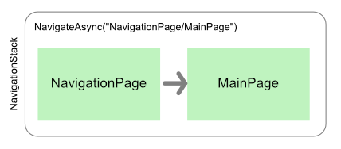

次に、MainPageからPage1に遷移するときは、NavigateAsync("Page1")で遷移します。

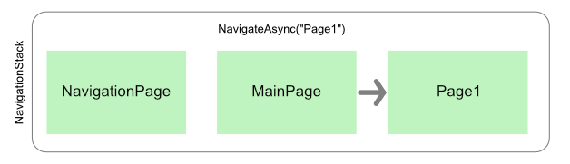

さらにPage1からPage2は、NavigateAsync("Page2")。

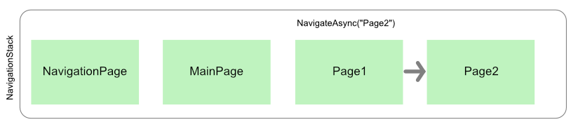

で、GoBackAsyncで帰ってくる(NavigationBarの戻るボタンで戻ってくる)と順番に前にページに戻っていきます。

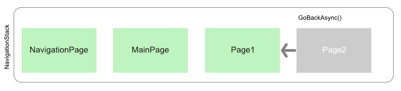

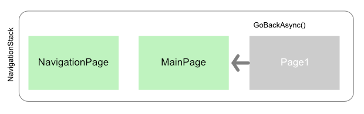

一個一個戻るのではなく、最初の状態に一発で戻したい場合は、GoBackToRootAsync()で戻れます。

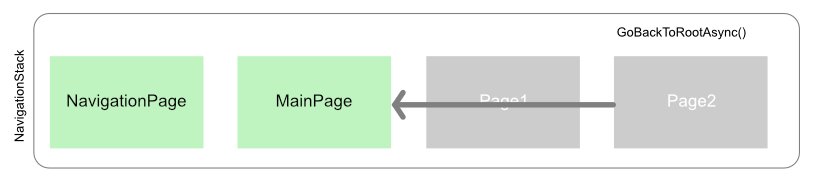

## Modal

Modalはnuits.jpさんの説明を読むとわかる通り、ModalStackに新しくNavigationStackを作ることになります。

なのでもしPage1からPage2に遷移する際、NavigateAsync("Page2", useModalNavigation: true)で遷移すると、ModalStackに新しくNavigationStackを積んだ上で、指定したページがルートになります。

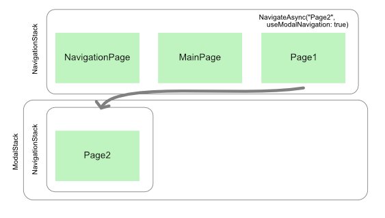

こうなった場合、modalじゃないGoBackAsyncではPage1に戻れなくなります。普通のGoBackAsyncはNavigationStack内で戻るからです。そこから抜け出す場合は、GoBackAsync(useModalNavigation: true)をするとPage1に戻ってきます。

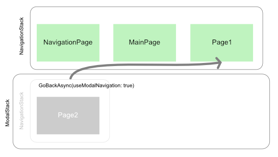

なので、Page2まで行ってから最初の状態に戻したいときに、NavigateAsync("NavigationPage/MainPage", useModalNavigation: true)、なんてやってしまうとこうなります。

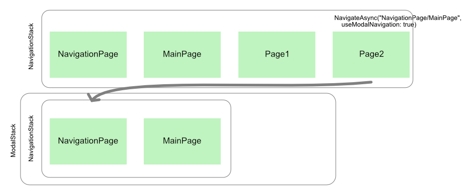

実は見えないところに、さっきまで遷移した状態が残ったままです。

ちなみに、PrismのNavigationServiceにはGetNavigationUriPath()というメソッドが用意されているので、それを呼んでやるとパスがどうなってるかわかります。上の状態だと、こういうパスが返ってきます。

```
/NavigationPage/MainPage/Page1/Page2/NavigationPage?useModalNavigation=true/MainPage
```

がっつり乗っかってきてるのがわかりますね。

ちなみにこれをmodalなしでやってしまうと、NavigationBarが二重に表示されます。スタックにさらにNavigationPageを表示して、その中にMainPageを表示させるからですね。

## NavigateAsyncのパス指定

NavigateAsync("Page1/Page2")のようにパスをつなげて書くと、その順番にスタックされます。これは、Page1→Page2に2回遷移してるのと同じなのでPage2から戻る場合はPage1に戻ります。

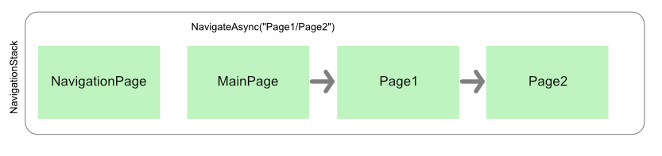

で、パスの先頭を / で始めると、今のNavigationStackがリセットされて、指定したパスで画面が生成され直します。別のインスタンスになってしまうので、ViewやViewModelに保持されていたものは消えてしまうでしょう。状態などをModelに保持していて、MainPageが生成されるときにそれに従って画面の状態を整えるみたいな作り方をしているのであれば、いったん画面の状態を全リセットする、みたいな使い方ができるでしょう。

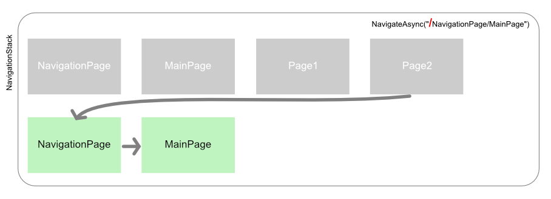

パスが / で始まらず、modalではない場合は、延々とページがスタックされて行ってるので、気をつけないと延々と画面が重なってるのに気がつかなかったり、戻りたいところに戻れず悩む、みたいなことがあります。また、先頭で書いちゃだめなところに / を書いてしまっているのに気がつかず、思った動作をしてくれない、みたいなハマり方はありがちです。

また、modalが絡むと「どこでmodalを解消するか」をちゃんと考えとかないと、こんがらがって戻れない、みたいなことにもなりかねません(仕様が途中で結構揺れて、画面の遷移がややこしくなるようなケースだと特に…)。

## 調べ方

まず、NavigationService.GetNavigationUriPath()でパスをチェックして、どんな積み方になってるかみます。

あとは、コードビハインドからNavigationプロパティを覗いてやると、Navigation.ModalStackやNavigation.NavigationStackの中に状態が入ってます。Xamarin.Formsの画面遷移の仕組みそのものなので、一度確認してみるとどうなってるか理解しやすいでしょう。

## 感想

と、書いてはみたものの、実際の開発ではしょっちゅうこんがらがってます。  
AからB-C-Dと遷移するけど、この場合はD-C-Bと戻れる、この場合はDからAに戻る…みたいなのが出てきて、あとからそれが変わったりするとかね…

Prismのnavigationも、引数でmodalかそうじゃないかを指定するので、いきなりPrismから入った人間としては、最初のうちはどっちがなんなんだかよくわからず苦労しました。本来のXamarin.Formsのnavigationから入ってたらもうちょっと理解が早かったのかもしれませんね。

