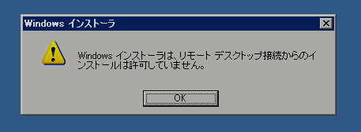

Visual Basic 6.0 SP6の累積的な更新プログラム([http://www.microsoft.com/ja-jp/download/details.aspx?id=7030](http://www.microsoft.com/ja-jp/download/details.aspx?id=7030))を、Windows 7のXP Mode上のWindows XPに適用しようとしたところ、このようなエラーが出ました。

<!--more-->

Windows 7環境のドライブにあるファイルをそのまま実行したのですが、感覚的には仮想環境側からネットワークでドライブを参照している感じなので、いまいちエラーの内容が飲み込みづらいですね。

仮想環境側のドライブにファイルをコピーしてから実行すれば大丈夫でした。