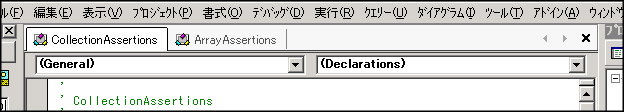
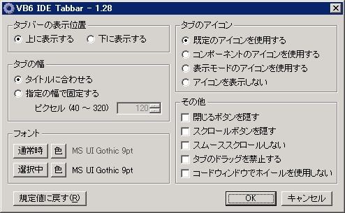
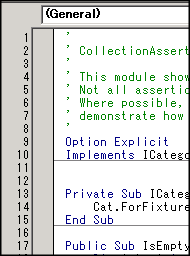

VB6のIDEは、さすがに古いこともありますし、まだまだ開発環境として洗練されたものではなかったので、今となっては何かと使いづらいところがあります。
それらを改善するアドインを紹介します。

<!--more-->

## VB6 IDE Tabbar

[http://www.vector.co.jp/soft/winnt/prog/se421000.html](http://www.vector.co.jp/soft/winnt/prog/se421000.html)

VB6のデフォルトのIDEは古来からのMDIアプリケーション形式で、最近のUIに慣れてしまっていたらどれだけウインドウが開いているのかわかりづらいし、切り替えも大変だったりします。
このアドインをいれるとタブが表示されるようになります。

タブの設定も色々出来るようになっています。

## **AddLineNumbers VB6/VBA**

[http://www.vector.co.jp/soft/winnt/prog/se457600.html](http://www.vector.co.jp/soft/winnt/prog/se457600.html)

行番号が出るようになります。
VB、特にフォームのコードなどは同じような表記が連続することがあり、どこを見ているのかわかりづらいこともありますので、行番号があると便利ですね。

## **AddAutoScroll for VB6/VBE6**

[http://www.vector.co.jp/soft/win95/prog/se431163.html](http://www.vector.co.jp/soft/win95/prog/se431163.html)

ホイールの動作を改善します。
マウスカーソルが外れていてもフォーカスのあるウインドウがスクロールするようになったり、ホイールクリックでのオートスクロールが出来るようになります。また、選択範囲のコメント/コメント解除、ブックマークの設定/解除、ブックマークへの移動などのショートカットキーが使えるようになります。

ただし、一番上のVB6 IDE Tabbarにもホイールを有効にする機能があるので、ホイールだけでよければ入れる必要はないでしょう。

## VB Add Comment

[http://www.vector.co.jp/soft/dl/win95/prog/se196764.html](http://www.vector.co.jp/soft/dl/win95/prog/se196764.html)

コメント記述をフォローしてくれるアドインです。
最近のVisual Studioでの「///」を打ったときのようなコメントのテンプレートを入れてくれたりします。
テンプレート等はすべてカスタマイズが可能ですので、どういう規則にも対応できそうです。