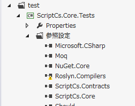
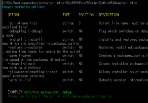
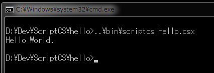
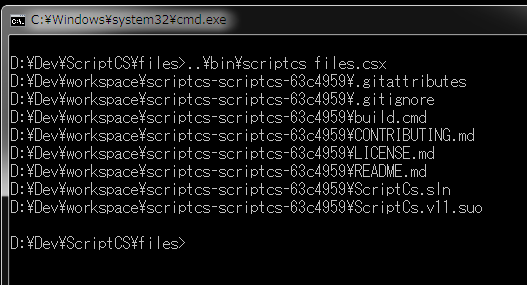

ScriptCS([http://scriptcs.net/](http://scriptcs.net/))は、C#をスクリプト的に使えるようにするプロジェクトです。
Visual Studio等を使ってプロジェクトを構築してコンパイルするのではなく、コードを記述したスクリプトとNuGetによるパッケージ管理でアプリケーションが構築できます。スクリプトなので実行ファイルやライブラリのファイルが生成されるわけではなく、そのまま実行されます。Node.jsとnpmで構築するアプリケーションと同じような構図ですね。

<!--more-->

## Contents

1.  ScriptCSのビルド
2.  実行してみる
3.  Hello World!
4.  ファイルの一覧を表示
5.  MessageBoxを表示
6.  雑感
環境は、Windows 7 Ultimate SP1 64bit、Visual Studio Express 2012 for Windows Desktop、あとは適当なテキストエディタです。

## ScriptCSのビルド

とりあえずGitHub([https://github.com/scriptcs/scriptcs](https://github.com/scriptcs/scriptcs))から、ソースを取得します。
ビルドはbuild.cmdが用意されているので実行しますと......
> ScriptCs.Contracts -> D:\Dev\workspace\scriptcs-scriptcs-63c4959\src\ScriptCs
>
> .Contracts\bin\Debug\ScriptCs.Contracts.dll
>
> Successfully installed 'Should 1.1.12.0'.
>
> Successfully installed 'Autofac.Mef 3.0.1'.
>
> Successfully installed 'NuGet.Core 2.2.0'.
>
> Successfully installed 'xunit 1.9.1'.
>
> Successfully installed 'Autofac 3.0.2'.
>
> Successfully installed 'Roslyn.Compilers.Common 1.2.20906.2'.
>
> Successfully installed 'Moq 4.0.10827'.
>
> Successfully installed 'Roslyn.Compilers.CSharp 1.2.20906.2'.
>
> All packages listed in packages.config are already installed.
>
> Successfully installed 'PowerArgs 1.5.0.0'.
>
> All packages listed in packages.config are already installed.
>
> ScriptCs.Core -> D:\Dev\workspace\scriptcs-scriptcs-63c4959\src\ScriptCs.Core
>
> \bin\Debug\ScriptCs.Core.dll
>
> C:\Windows\Microsoft.NET\Framework\v4.0.30319\Microsoft.Common.targets(1578,5):
>
>  warning MSB3245: この参照を解決できませんでした。アセンブリ "Roslyn.Compilers,
>
>  Version=1.2.0.0, Cul
>
>  ture=neutral, PublicKeyToken=31bf3856ad364e35, processorArchitecture=MSIL" が見
>
>  つか
>
>  りませんでした。アセンブリが間違いなくディスクに存在することを確認してください。
>
>  コードにこの参照が必要な場合、コンパイル エラーが発生する可能性があります。
>
>  [D:\Dev\workspace\scriptcs-scriptcs-63c4959\test\ScriptCs.Core.Tests\ScriptCs.
>
>  Core.Tests.csproj]
>
> ScriptCs.Engine.Roslyn -> D:\Dev\workspace\scriptcs-scriptcs-63c4959\src\Scri
>
> ptCs.Engine.Roslyn\bin\Debug\ScriptCs.Engine.Roslyn.dll
>
> ScriptCs.Core.Tests -> D:\Dev\workspace\scriptcs-scriptcs-63c4959\test\Script
>
> Cs.Core.Tests\bin\Debug\ScriptCs.Core.Tests.dll
>
> ScriptCs.Engine.Roslyn.Tests -> D:\Dev\workspace\scriptcs-scriptcs-63c4959\te
>
> st\ScriptCs.Engine.Roslyn.Tests\bin\Debug\ScriptCs.Engine.Roslyn.Tests.dll
>
> ScriptCs -> D:\Dev\workspace\scriptcs-scriptcs-63c4959\src\ScriptCs\bin\Debug
>
> \scriptcs.exe
>
> ScriptCs.Tests -> D:\Dev\workspace\scriptcs-scriptcs-63c4959\test\ScriptCs.Te
>
> sts\bin\Debug\ScriptCs.Tests.dll
>
> xUnit.net MSBuild runner (32-bit .NET 4.0.30319.18034)
>
> xunit.dll: Version 1.9.1.1600
>
> Test assembly: D:\Dev\workspace\scriptcs-scriptcs-63c4959\test\ScriptCs.Core.
>
> Tests\bin\Debug\ScriptCs.Core.Tests.dll
>
> Tests: 50, Failures: 0, Skipped: 0, Time: 0.842 seconds
>
> xunit.dll: Version 1.9.1.1600
>
> Test assembly: D:\Dev\workspace\scriptcs-scriptcs-63c4959\test\ScriptCs.Engin
>
> e.Roslyn.Tests\bin\Debug\ScriptCs.Engine.Roslyn.Tests.dll
>
> D:\Dev\workspace\scriptcs-scriptcs-63c4959\Build\Build.proj(51,5): error : Scri
>
>  ptCs.Tests.RoslynScriptDebuggerEngineTests+TheExecuteMethod.ShouldThrowExceptio
>
>  nThrownByScriptWhenErrorOccurs: Should.Core.Exceptions.ContainsException : Asse
>
>  rt.Contains() failure: Not found: line 2
>
>  D:\Dev\workspace\scriptcs-scriptcs-63c4959\Build\Build.proj(51,5): error : 場
>
>
> 所 Should.Core.Assertions.Assert.Contains(String expectedSubString, String actua
>
>
> lString, StringComparison comparisonType)
>
>  D:\Dev\workspace\scriptcs-scriptcs-63c4959\Build\Build.proj(51,5): error : 場
>
>
> 所 Should.StringAssertionExtensions.ShouldContain(String actualString, String ex
>
>
> pectedSubString)
>
>  D:\Dev\workspace\scriptcs-scriptcs-63c4959\Build\Build.proj(51,5): error : 場
>
>
> 所 ScriptCs.Tests.RoslynScriptDebuggerEngineTests.TheExecuteMethod.ShouldThrowEx
>
>
> ceptionThrownByScriptWhenErrorOccurs() 場所 d:\Dev\workspace\scriptcs-scriptcs-6
>
>  3
>
>  c4959\test\ScriptCs.Engine.Roslyn.Tests\RoslynScriptDebuggerEngine.cs:行 43
>
> Tests: 2, Failures: 1, Skipped: 0, Time: 2.005 seconds
>
> xunit.dll: Version 1.9.1.1600
>
> Test assembly: D:\Dev\workspace\scriptcs-scriptcs-63c4959\test\ScriptCs.Tests
>
> \bin\Debug\ScriptCs.Tests.dll
>
> Tests: 20, Failures: 0, Skipped: 0, Time: 0.588 seconds
>
>
> *** BUILD FAILED ***
と、エラーが出ました。
黄色いところは、ScriptCs.Core.Testsプロジェクトの、Roslyn.Compilersへの参照設定がちゃんと出来てないと言うことのようですので、ScriptCs.slnをVisual Studioで開いて該当するところを見てみると、確かに参照がちゃんと出来ていないようです。

これを一旦削除して、packages\Roslyn.Compilers.Common.1.2.20906.2\lib\net45にあるRoslyn.Compilers.dllを指定し直します。

赤いところは、ユニットテストの一部でエラーが出ています。
例外の発生時のメッセージに「line 2」が含まれていることを期待しているようですが、含まれていないのでテスト失敗になっています。

RoslynScriptDebugger.Engine.csの43行目です。

    exception.Message.ShouldContain("line 2");

ちょっと例外を出そうとしているところを見てみたんですが、いまいちどうなっているべきなのか把握できないのでここをコメントアウトします。

上記2点の修正をした上でソリューションを保存して再度Build.cmdを実行すると、無事BUILD SUCCESSFULとなりました。

※ちなみに、Visual Studioでソリューションを開いたのなら、Build.cmdを無理に使う必要はありません。ただその場合ユニットテストは実行されませんが......

## 実行してみる

ビルドした成果物は、「src\ScriptCS\bin\Debug」にありますので、そこにPathを通すなり、ファイル一式をPathの通ったディレクトリにコピーするなり、めんどくさくてもフルパスで指定するなりして、コマンドプロンプトから「scriptcs.exe」を実行してみます。

こんな表示がでます。

## Hello World!

どこか適当なところにディレクトリを作り、その中に「hello.csx」というテキストファイルを作成します。
中身は下記の通りです。

    Console.WriteLine("Hello World!");

そして、scriptcs.exeの引数にそのファイル名を渡して実行します。

    scriptcs hello.csx

ちゃんと出力されました。

## ファイルの一覧を表示

下記のようなスクリプトを書きます。

    using System.IO;

    string[] files = Directory.GetFiles(@"D:\Dev\workspace\scriptcs-scriptcs-63c4959");
    foreach (string s in files)
    {
        Console.WriteLine(s);
    }

実行するとこうなります。

## MessageBoxを表示

MessageBoxは、System.Windows.Formsの指定が必要ですが、そのまま記述しても「Formsというnamespaceが見つからない」とエラーが出ます。
dllを明示的に指定する必要があります。

    #r "C:\Program Files(省略)System.Windows.Forms.dll"

    using System.Windows.Forms;

    MessageBox.Show("Hello World!");

## 雑感

ScriptCS: C#をスクリプト言語にする(InfoQ)
[http://www.infoq.com/jp/news/2013/05/ScriptCS](http://www.infoq.com/jp/news/2013/05/ScriptCS)

ScriptCSはこの記事を見て初めて知ったのですが、触ってみると面白いですね。
最近Node.jsを少し触っていますが、JavaScriptが昔から馴染めず[CoffeeScript](http://coffeescript.org/)や[TypeScript](http://www.typescriptlang.org/)などはどうなのかと脱線しがちですが、C#で同じようなことが出来るようになってくるとわかりやすそうでいいですね。

### Quick startが実行できず

[ScriptCS](http://scriptcs.net/)のQuick startの所にある短いコードは、NuGetでパッケージを用意してWebで待ち受けるみたいな、Node.jsのサンプルでありがちなものなのでやってみたんですが、うまくいかないままです。
今そこにこだわってもしょうがないので放置したままです。

### Roslyn

[Roslyn](http://msdn.microsoft.com/en-us/vstudio/roslyn.aspx)という技術も知らなかったのですが、コンパイラの中の機能も活用出来るようになってきたのですね。

Roslyn(++C++; // 未確認飛行 C ブログ)
[http://ufcpp.wordpress.com/2011/07/22/roslyn/](http://ufcpp.wordpress.com/2011/07/22/roslyn/)

Roslynが何者なのか解説してくれています。

&nbsp;

&nbsp;