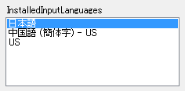
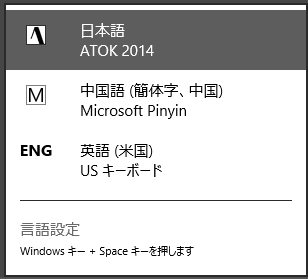
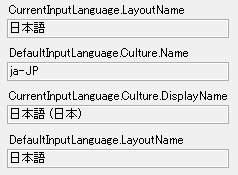

.netのテキストボックスには、ImeModeというプロパティがあり、業務システムなんかだとまあ大体IMEのオン/オフを制御しますね。
ただ日本語、中国語など複数のIMEを切り替えるようにはできていませんので、日本語だったら日本語IME、中国語だったら中国語IME......というのはImeModeだとできません。

[System.Windows.Forms.InputLanguage](http://msdn.microsoft.com/ja-jp/library/system.windows.forms.inputlanguage(v=vs.110).aspx)を使うとIME自体を変更することができます。

### インストールされているIME

InputLanguage.InstalledInputLanguagesにCollectionとして入っています。

    foreach (InputLanguage il in InputLanguage.InstalledInputLanguages)
    {
        listBox1.Items.Add(il.LayoutName);
    }

こんな感じでListBoxに列挙することができます。

ちなみにインストールされているのは上記になります。

### 現在選択されているIME

InputLanguage.CurrentInputLanguageが現在のIMEです。
ちなみにInputLanguage.DefaultInputLanguageは、デフォルト指定しているIMEが入っています。

    //現在選択されているIME
    this.textBox1.Text = InputLanguage.CurrentInputLanguage.LayoutName;
    this.textBox2.Text = InputLanguage.CurrentInputLanguage.Culture.Name;
    this.textBox3.Text = InputLanguage.CurrentInputLanguage.Culture.DisplayName;

    //デフォルトに指定されているIME
    this.textBox4.Text = InputLanguage.DefaultInputLanguage.LayoutName;

こんな感じです。

&nbsp;

### IMEを切り替える

使うIMEを切り替える場合は、Windows8だったら「Win+Space」とか「Shift+Alt」とかで変わりますが、.netではInputLanguage.CurrentInputLanguageに変えたいInputLanguageを設定するだけです。

    private void ChangeIme(string culture)
    {
        foreach (InputLanguage il in InputLanguage.InstalledInputLanguages)
        {
            if (il.Culture.Name == culture)
            {
                this.ChangeIme(il);
                break;
            }
        }
    }

    private void ChangeIme(InputLanguage inputLanguage)
    {
        InputLanguage.CurrentInputLanguage = inputLanguage;
    }

とりあえずこんな感じにしてみました。

Culture.Name(ja-JPとかzh-CN)を指定したら、そのcultureのInputLanguageを探してそれをCurrentInputLanguageにぶっ込むだけです。
foreachで総当たりしてるだけなので、Culture.Name以外で識別できるものだったら何でもいいですね。
なんかさくっと検索する方法が見つからなかったので、foreachで回してます。まあ、入っているInputMethodなんか知れてますし。

### IMEが切り替わった時のイベント

Formには[InputLanguageChanging](http://msdn.microsoft.com/ja-jp/library/system.windows.forms.form.inputlanguagechanging(v=vs.110).aspx)と[InputLanguageChanged](http://msdn.microsoft.com/ja-jp/library/system.windows.forms.form.inputlanguagechanged(v=vs.110).aspx)と言うのがありますので、それを使うといいでしょう。

これは、コード上で変更しても、Windowsの操作で変更しても発生しますので、もしなにか使って欲しくないIMEに切り替えられたら......とかいうときにも使えますが、そんなケースそんなにあるようにも思えません。
Changedの方で画面表示を変えてあげるぐらいでしょうか。

### ImeModeとの兼ね合い

これでIMEを切り替えた時には、ImeModeも意識しておかないといけません。
たとえば、テキストボックスのEnter時にIMEを切り替えるようにしておいたとして、その時ImeModeをOffにしてあると、IMEが変わっても結局直接入力と変わりません。