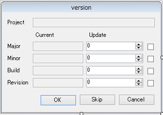

## コマンドラインの仕様

必要な情報は全部引数で渡します。

* 対象のAssemblyInfo.csのパス[必須]......t=(path)
* プロジェクト名......p=(projectname)
* バージョンの設定......major'minor'build'revision=(setting)
* 確認ダイアログを出すかどうか......c

バージョンの設定のsettingは下記のようになります。

* 数値......固定値をセットします。
* increment:value......value分加算します
* datetime:format......現在時刻をformat形式で出力します。formatはDateTimeの仕様そのままです。

バージョンの設定は省略可能で、省略された部分は変更されず元のままです。なので、どれも指定しなければ何も変更されないのですが「確認ダイアログ」を出せば操作することはできるので、いちいち手動で操作したい場合は何も指定しなければいいですね。
あと、バージョンを構成する各数値は0～UInt16.MaxValue - 1の範囲なので、もしそれを超える範囲が指定されたら0にすることにします。

プロジェクト名を渡すようにしているのは、ソリューションに複数のプロジェクトがビルドされるような時にどのプロジェクトのバージョンが出てるかわからないからです。省略しても処理に影響はありません。

コマンドラインはこんな感じになります。

```powershell
# minorを+1する、確認ダイアログを出す
version.exe t=$(ProjectDir)Properties\AssemblyInfo.cs p=$(ProjectName) minor=increment:1 c

# buildをyyyyMMdd、revisionをHHmmss
version.exe t=$(ProjectDir)Properties\AssemblyInfo.cs p=$(ProjectName) build=datetime:MMdd revision=datetime:HHmm
```

こんな感じになります。

バージョンの各要素はintなのでその範囲を超えては設定できませんし、数値型なので「HHmm」で「0930」を想定したとしても「930」になります。「ver 1.01」みたいな形式にしたい場合などもそうですが、こう言うのは表示する時のフォーマットで対応するしかありません。

コマンドライン引数を取得するコードは下記のようにしておきます。

```csharp
//コマンドライン引数をDictionaryに
var optionValues = args.Select(s => s.Split('=')).ToDictionary(a => a[0], a => a.Length > 1 ? a[1] : "");
```

引数の指定がkey=valueか、keyだけなので単純に=でsplitしてDictionaryに入れておきます。
実際に使う時にContainsKeyで確認します。

## 戻り値

このコマンドを実行した時の戻り値は、

* 0......正常終了
* 1......異常終了
* 2......ユーザーがキャンセルした

の3つだけにしておきます。

コンソールアプリケーションで、プログラム終了時の戻り値を返したい場合は、

```csharp
class Program
{
    static int Main(string[] args)
{
```

このように、そのままだとvoidになっているところをintとかに変更しておいて、プログラム中で、return 0;とかreturn 1;とかします。

## AssemblyInfo.csのバージョン部分の取得

```csharp
//AssemblyVersionの行を探す
Regex regex =
    new Regex("(?<pre>^\\[assembly: AssemblyVersion\\(\")(.*)(?<post>\"\\)\\])", RegexOptions.Multiline);
//バージョン表記の部分を取得
string versionString =
    regex.Matches(contents)[0].Groups[1].Value;
//バージョンの各要素を数値にしてListで取得
List<UInt16> currentVersion =
    new Regex("\\d+").Matches(versionString).Cast<Match>().Select(m => Convert.ToUInt16(m.Value)).ToList();
```

1個目の検索は、あとで置換する時にもう一度使います。存在すること前提で決め打ちしています。
?&lt;pre&gt;とか名前をつけてあるのは、名前なしで$1とかだとバージョンの最初の数字とくっついてちゃんと置換できないからです。
これで、currentVersionにバージョンのそれぞれの数字がリストになっているはずです。

## バージョンの処理

```csharp
//バージョンの操作
List<UInt16> updateVersion = new List<UInt16>();

for (int i = 0; i < 4; i++)
{
    if (optionValues.ContainsKey(CONDITIONS[i]))
    {
        string[] setting = optionValues[CONDITIONS[i]].Split(':');
        UInt16 condValue;
        if (setting.Length == 1 && UInt16.TryParse(setting[0], out condValue))
        {
            updateVersion.Add(condValue);
        }
        else if (setting.Length == 2 && setting[0] == RULE_INCREMENT)
        {
            if (UInt16.TryParse(setting[1], out condValue))
                if (currentVersion.Count > i)
                    updateVersion.Add(Convert.ToUInt16(currentVersion[i] + condValue));
                else
                    updateVersion.Add(condValue);
            else
                updateVersion.Add(0);
        }
        else if (setting.Length == 2 && setting[0] == RULE_DATETIME)
        {
            if (UInt16.TryParse(DateTime.Now.ToString(setting[1]), out condValue))
                updateVersion.Add(condValue);
            else
                updateVersion.Add(0);
        }
    }
    else
    {
        if (currentVersion.Count > i)
            updateVersion.Add(currentVersion[i]);
    }
}
```

バージョンのところは、major/minor/build/revisionの指定があれば、それに対する処理を行い、なければそのままupdateVersionに追加しています。

## 確認ダイアログ



こんな感じでデザインして、引数で指定されたProjectName、currentVersion、updateVersionをプロパティで受け渡しできるようにしておきます。
バージョン毎のチェックボックスは、チェックしていたら指定された値に変更する、されていなければ変更しない、という指定です。
Skipボタンをクリックするとバージョンを変更せず、Currentのままにします。
Cancelをクリックすると、コマンドが1を返すのでビルド前イベントがエラーとなり、ビルドが実行されません。

このダイアログは、コマンドライン引数でcが指定された時だけ出します。

## AssemblyInfo.csの更新

```csharp
//AssemblyVersionを置換
contents = regex.Replace(contents, "${pre}" + string.Join(".", updateVersion) + "${post}");

//AssemblyFileVersionも置換
Regex regexFileVersion = new Regex("(?<pre>^\\[assembly: AssemblyFileVersion\\(\")(.*)(?<post>\"\\)\\])", RegexOptions.Multiline);
contents = regexFileVersion.Replace(contents, "${pre}" + string.Join(".", updateVersion) + "${post}");

//AssemblyInfo.csに書き戻し
File.WriteAllText(targetFile, contents);
```

最後にAssemblyInfo.csを書き換えます。
バージョンの取得に使ったRegexを使ってそのまま置換します。
今回は同時にAssemblyFileVersionも同じ値に書き換えるようにしています。

## 完成

ざっくりこんな感じで使えるようになっています。
個人で使うものですし、あんまり細かい作り込みもしませんし、エラー処理も全体try-catchで何か出たらreturn 1;です。
最低限、前回書いたようなカウントアップができればいいわけですし、何か不足すればまた修正すればいいですね。

こんな感じで、各プロジェクトのバージョン番号を管理しつつ作業ができるようになりました。