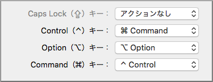

iOSの開発なんかもちょっと面倒を見ないといけなくなったこともあり、作業環境がMac Book Proになりました。これまでほとんど触ったことはなかったのですが、やっと慣れてきました。
ベースがunixなだけあって、PHPとかWebが関連するようなものを扱う場合は非常に便利ですね。Web系の人たちがみんなMacを使っているのもよくわかります。

現在に至るまでの最大の難関はキーボードでした。

ながらくWindowsで、キー配置を少しカスタマイズして使ってきたこともあり、体に染みついている動きを変えるのは困難......というか不可能だったので、カスタマイズ不可欠です。特に、修飾キー周りは、Control,Option,Commandが全くなじめません。へんてこりんな記号が未だに覚えられません。
キーボードは愛用している外付けのもの(FILCOのMinira)でMac用のキートップではないので、ショートカットキーで「(上矢印)(クローバーみたいなやつ)G」みたいな表示をされても、いったいどれなんだかわからない......

さらに、環境がMacになったとはいえWindows系の仕事もあるので、VMWareFusionを使って、仮想のWindows環境での作業もありますので、今まで通りの操作ができないと結構厳しいです。

で、あれこれ試行錯誤した結果、

*   キーボードのdepスイッチでctrlとcapsを入れ替え
*   Macの修飾キーを設定を変更
*   Karabinerを使って一部キーをカスタマイズ
*   VMWareの環境設定
*   VMWare上のWindowsの「のどか」で右AltをToggleIME

という風にして、ストレスのない環境ができました。

## キーボードのdepスイッチでctrlとcapsを入れ替え

FILCOのキーボードは、depスイッチで一部のキー配置を変更できますので、ctrlとcaps入れ替えをonにします。
この設定は、Windowsの時は「のどか」でやっていました。

## Macの修飾キー設定を変更

Windowsで言うCtrl+なんとかな操作が、Macだと軒並みCommand+なんとかになってしまい、キーの位置が非常に使いづらいですね。
なので、Macの環境設定で、ControlとCommandを入れ替えます。あと、Caps LockはVMWare上のWindowsでややこしい動きをするので、アクションなしにしています。

## Karabinerを使って一部キーをカスタマイズ

Karabinerは、かなり細かくいろいろカスタマイズできますが、カスタマイズしたのは2つだけ。

*   Option_RをKana Eisuu
*   VMWareの時にCommand_LをControl_Lにする

### Option_RをKana Eisuu

Windowsの時に、「右AltをIME ON/OFF」にしていた設定を再現しています。
外付けキーボードの右AltがMacだとOption_Rになるので、これで同じ動作をしてくれます。

### VMWareの時にCommand_LをControl_Lにする

ややこしいんですが、Aの左にあるやつの設定です。
Macの修飾キー設定で「Aの横はCommand」になっているんですが、このままだとWindows環境の時に、「Aの左がCtrl」になってくれないので、VMWareの時にはまた元に戻す、ってことになります。

## VMWareの環境設定

VMWareの環境設定-キーボードとマウスで、

*   キーマッピングの「キーマッピングを有効にする」「言語固有のキーマッピングを有効にする」をオフに。→ここでもカスタマイズはできそうだけど、特に必要ない。
*   Macホストショートカットで「Windowsキーでは、以下を使用」を「右コマンドキーにする」→キーボードに右コマンドキーはないので、実質「Windowsキーをなくす」設定

## Windows側の「のどか」設定

で、最後にWindowsに入れてある「のどか」でRightAltをToggleIMEにする。
(ほかにもいくつかカスタマイズはしているけど、Windows上だけの話で特に関係ない)

## おしまい

こんな感じで、今までと同じような感覚で操作ができるようになりました。

ただ、一点だけどうしようもないのが、Macの「Command+h」。
これを押すと、最前面のアプリが最小化されるみたいなんですが、このショートカットはかなり深いところで設定されているらしく、カスタマイズする方法が見つからないのです。かろうじて、「ヘルプが出るようにすればアプリは最小化されないよ」みたいなのが見つかったんですが、コレジャナイ感満載......

Windows、特にMicrosoft系のアプリケーションだと、Ctrl+hは置換のショートカットで、上記カスタマイズを行った環境で置換操作をしようとすると、画面が突然消えるのです。何でこいつだけこんな特別扱いなんですかね。