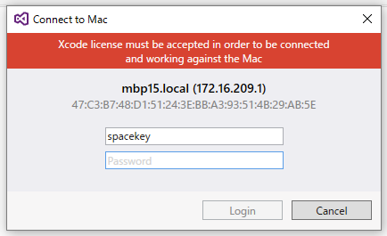

Xamarinをちょっと触っているのですが、Macを新しくしたらWindows側のXamarin Mac AgentからMacにログインできなくなりました。

ネットワークとかMacのSharing設定ではなく、なんかライセンスを承認してないとか言うエラーです。でもMac側では普通にXcodeも使える状態ですので調べてみたら、

[Xamarin.iOS 10.0.0.6: Mac Agent can't connect after update](https://forums.xamarin.com/discussion/77704/xamarin-ios-10-0-0-6-mac-agent-cant-connect-after-update)

> Solution:
>
> 1.  Go to Xcode -> Preferences -> Location
> 2.  Check if "Command Line Tool" set
> 3.  Run `sudo xcodebuild -license` in terminal
> 4.  Follow instructions

こう言うのがあったので試してみいたら接続できるようになりました。

そういえば、Xcodeをインストールする前にCommandlineToolsを入れたような記憶があるのでそれのせいかもしれません。