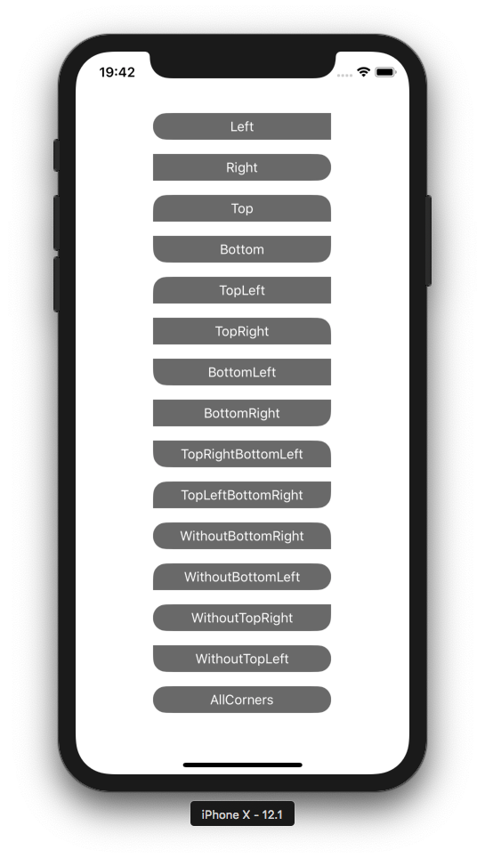
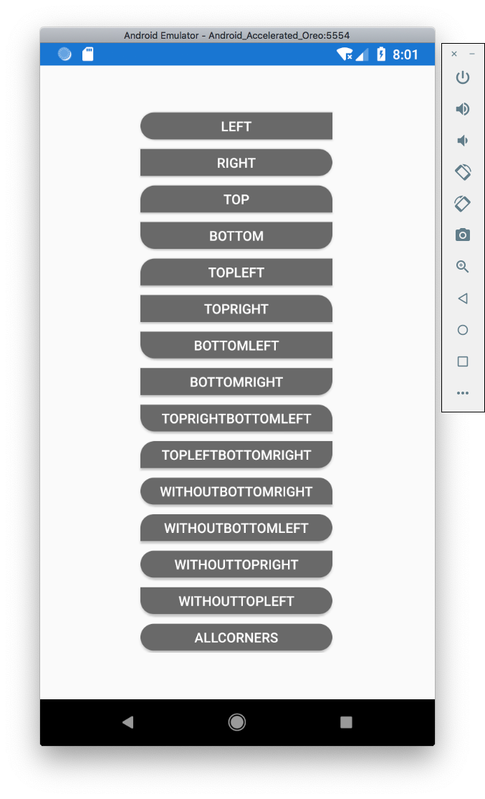

Xamarin.Formsのボタンは、CornerRadiusの指定で角が丸くできますが、一部の角だけ丸くするということができません。デザインの都合上、左側だけ、とか、下の2つだけみたいなのが必要になったのでCustomRendererで作ってみました。

## FlexRoundCornerButton

まず、丸くする角に関するプロパティとそのRadiusのプロパティを持ったコントロールを作ります。

CustomRendererで表示を後から変更する仕組み上、もともとButtonにあるCorcerRadiusは0固定にしておかないと、標準の角丸が設定された上で、さらに独自の角丸が施されてしまうので、なんとなく冗長になってしまうのが残念。

```csharp
public class FlexRoundCornerButton : Button
{
    public FlexRoundCornerButton()
    {
        CornerRadius = 0;
    }

    public static readonly BindableProperty RoundCornersProperty =
        BindableProperty.Create(
            "RoundCorners",
            typeof(Corners),
            typeof(FlexRoundCornerButton),
            Corners.None);

    public Corners RoundCorners
    {
        get => (Corners)GetValue(RoundCornersProperty);
        set => SetValue(RoundCornersProperty, value);
    }

    public static readonly BindableProperty RoundCornerRadiusProperty =
        BindableProperty.Create(
            "RoundCornerRadius",
            typeof(double),
            typeof(FlexRoundCornerButton),
            0d);

    public double RoundCornerRadius
    {
        get => (double)GetValue(RoundCornerRadiusProperty);
        set => SetValue(RoundCornerRadiusProperty, value);
    }
}

public enum Corners
{
    None,
    TopLeft,
    TopRight,
    Top,
    BottomLeft,
    Left,
    TopRightBottomLeft,
    WithoutBottomRight,
    BottomRight,
    TopLeftBottomRight,
    Right,
    WithoutBottomLeft,
    Bottom,
    WithoutTopRight,
    WithoutTopLeft,
    AllCorners = int.MaxValue
}
```

## FlexRoundCornerButtonRenderer(iOS)

iOSのレンダラーです。
角丸のレイヤーでマスクすることで表示をカスタマイズしています。

```csharp
public class FlexRoundCornerButtonRenderer : ButtonRenderer
{
    protected override void OnElementPropertyChanged (object sender, PropertyChangedEventArgs e)
    {
        base.OnElementPropertyChanged (sender, e);

        SetNeedsDisplay();
    }

    public override void Draw(CGRect rect)
    {
        base.Draw(rect);

        if (Element == null)
            return;

        var control = (FlexRoundCornerButton)Element;

        var mPath = UIBezierPath.FromRoundedRect(
            Layer.Bounds,
            control.RoundCorners == Corners.AllCorners ? UIRectCorner.AllCorners : (UIRectCorner)control.RoundCorners,
            new CGSize(control.RoundCornerRadius, control.RoundCornerRadius));

        var maskLayer = new CAShapeLayer
        {
            Frame = Layer.Bounds,
            Path = mPath.CGPath
        };

        Layer.Mask = maskLayer;
    }
}
```

## FlexRoundCornerButtonRenderer(Android)

Androidのレンダラーです。
こっちは、バックグラウンドを操作して、角ごとにradiusを指定することになります。

```csharp
public class FlexRoundCornerButtonRenderer : ButtonRenderer
{
    public FlexRoundCornerButtonRenderer(Context context) : base(context) { }

    protected override void OnElementChanged(ElementChangedEventArgs<Button> e)
    {
        base.OnElementChanged(e);

        if (Element == null)
            return;

        var control = (FlexRoundCornerButton)Element;

        var background = new GradientDrawable();
        background.SetShape(ShapeType.Rectangle);
        background.SetColor(control.BackgroundColor.ToAndroid());
        background.SetStroke((int)Context.ToPixels(control.BorderWidth), control.BorderColor.ToAndroid());
        background.SetCornerRadii(SetupCornerRadii(control.RoundCorners, Context.ToPixels(control.RoundCornerRadius)));

        Control.SetBackground(background);
    }

    private float[] SetupCornerRadii(Corners corners, float radius)
    {
        var radii = new float[] { 0, 0, 0, 0, 0, 0, 0, 0 };

        switch (corners)
        {
            case Corners.None:
                break;
            case Corners.TopLeft:
                radii[0] = radius;
                radii[1] = radius;
                break;
            case Corners.TopRight:
                radii[2] = radius;
                radii[3] = radius;
                break;
            case Corners.Top:
                radii[0] = radius;
                radii[1] = radius;
                radii[2] = radius;
                radii[3] = radius;
                break;
            case Corners.BottomLeft:
                radii[6] = radius;
                radii[7] = radius;
                break;
            case Corners.Left:
                radii[0] = radius;
                radii[1] = radius;
                radii[6] = radius;
                radii[7] = radius;
                break;
            case Corners.TopRightBottomLeft:
                radii[2] = radius;
                radii[3] = radius;
                radii[6] = radius;
                radii[7] = radius;
                break;
            case Corners.WithoutBottomRight:
                radii[0] = radius;
                radii[1] = radius;
                radii[2] = radius;
                radii[3] = radius;
                radii[6] = radius;
                radii[7] = radius;
                break;
            case Corners.BottomRight:
                radii[4] = radius;
                radii[5] = radius;
                break;
            case Corners.TopLeftBottomRight:
                radii[0] = radius;
                radii[1] = radius;
                radii[4] = radius;
                radii[5] = radius;
                break;
            case Corners.Right:
                radii[2] = radius;
                radii[3] = radius;
                radii[4] = radius;
                radii[5] = radius;
                break;
            case Corners.WithoutBottomLeft:
                radii[0] = radius;
                radii[1] = radius;
                radii[2] = radius;
                radii[3] = radius;
                radii[4] = radius;
                radii[5] = radius;
                break;
            case Corners.Bottom:
                radii[4] = radius;
                radii[5] = radius;
                radii[6] = radius;
                radii[7] = radius;
                break;
            case Corners.WithoutTopRight:
                radii[0] = radius;
                radii[1] = radius;
                radii[4] = radius;
                radii[5] = radius;
                radii[6] = radius;
                radii[7] = radius;
                break;
            case Corners.WithoutTopLeft:
                radii[2] = radius;
                radii[3] = radius;
                radii[4] = radius;
                radii[5] = radius;
                radii[6] = radius;
                radii[7] = radius;
                break;
            case Corners.AllCorners:
                radii[0] = radius;
                radii[1] = radius;
                radii[2] = radius;
                radii[3] = radius;
                radii[4] = radius;
                radii[5] = radius;
                radii[6] = radius;
                radii[7] = radius;
                break;
        }

        return radii;
    }
```

## MainWindow

```xml
<?xml version="1.0" encoding="utf-8"?>

<ContentPage xmlns="http://xamarin.com/schemas/2014/forms"
             xmlns:x="http://schemas.microsoft.com/winfx/2009/xaml"
             xmlns:controls="clr-namespace:BlankApp12.Controls;assembly=BlankApp12"
             x:Class="BlankApp12.Views.MainPage">

  <ContentPage.Resources>
    <ResourceDictionary>
      <Style TargetType="controls:FlexRoundCornerButton">
        <Setter Property="BackgroundColor" Value="DimGray"/>
        <Setter Property="TextColor" Value="White"/>
        <Setter Property="WidthRequest" Value="200"/>
        <Setter Property="HeightRequest" Value="30"/>
        <Setter Property="RoundCornerRadius" Value="15"/>
        <Setter Property="Margin" Value="5"/>
      </Style>
    </ResourceDictionary>
  </ContentPage.Resources>

  <StackLayout HorizontalOptions="CenterAndExpand" VerticalOptions="CenterAndExpand">
    <controls:FlexRoundCornerButton Text="Left"
                                    RoundCorners="Left"/>
    <controls:FlexRoundCornerButton Text="Right"
                                    RoundCorners="Right"/>
    <controls:FlexRoundCornerButton Text="Top"
                                    RoundCorners="Top"/>
    <controls:FlexRoundCornerButton Text="Bottom"
                                    RoundCorners="Bottom"/>
    <controls:FlexRoundCornerButton Text="TopLeft"
                                    RoundCorners="TopLeft"/>
    <controls:FlexRoundCornerButton Text="TopRight"
                                    RoundCorners="TopRight"/>
    <controls:FlexRoundCornerButton Text="BottomLeft"
                                    RoundCorners="BottomLeft"/>
    <controls:FlexRoundCornerButton Text="BottomRight"
                                    RoundCorners="BottomRight"/>
    <controls:FlexRoundCornerButton Text="TopRightBottomLeft"
                                    RoundCorners="TopRightBottomLeft"/>
    <controls:FlexRoundCornerButton Text="TopLeftBottomRight"
                                    RoundCorners="TopLeftBottomRight"/>
    <controls:FlexRoundCornerButton Text="WithoutBottomRight"
                                    RoundCorners="WithoutBottomRight"/>
    <controls:FlexRoundCornerButton Text="WithoutBottomLeft"
                                    RoundCorners="WithoutBottomLeft"/>
    <controls:FlexRoundCornerButton Text="WithoutTopRight"
                                    RoundCorners="WithoutTopRight"/>
    <controls:FlexRoundCornerButton Text="WithoutTopLeft"
                                    RoundCorners="WithoutTopLeft"/>
    <controls:FlexRoundCornerButton Text="AllCorners"
                                    RoundCorners="AllCorners"/>
  </StackLayout>

</ContentPage>
```





※Androidの画像はちょっときれいに入りきらなかったので、上のXAMLとはちょっと違うパラメータになってます。

## あとがき

rendererのコードを見るとわかるとおり、iOSでもAndroidでも、角丸のパラメータは、xとyで個別に指定できる用になってますので、丸さ加減を縦や横に引き延ばすこともできます。カスタムコントロールのプロパティを、Androidの指定のような8つのパラメータを受け取れるような感じにすれば、もっと柔軟に角が制御できそうです(今はこれで事足りてるのでそこまでしませんけど)。