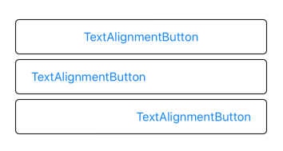
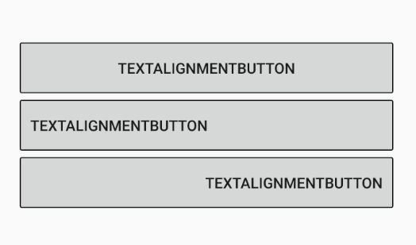

ボタンのテキスト水平位置が真ん中固定なので、簡易的に左右に寄せられるようにしてみました。  
テキストを左右に寄せたいケースでは、無理にボタンを使わず他のコントロールにTapRecognizerをつけるという手もあるんですが、以前作った[フレキシブル角丸ボタン](https://spacekey.info/2164/)を使っているところで、どうしてもテキスト水平位置を変えたい要望が出たのでやってみました。

## TextAlignmentButton

まず単純に水平位置のプロパティを追加したボタンを作ります。

```csharp
public class TextAlignmentButton : Button
{
    public static readonly BindableProperty HorizontalTextAlignmentProperty =
        BindableProperty.Create(
            "HorizontalTextAlignment",
            typeof(TextAlignment),
            typeof(TextAlignmentButton),
            TextAlignment.Center);

    public TextAlignment HorizontalTextAlignment
    {
        get => (TextAlignment)GetValue(HorizontalTextAlignmentProperty);
        set => SetValue(HorizontalTextAlignmentProperty, value);
    }
}
```

## TextAlignmentButtonRenderer(iOS)

iOSは、UIButtonのプロパティを操作することになります。  
そのままだと、左右に寄せたときにべったり貼り付いてしまうので、Paddingの左右を反映しておきます。

```csharp
public class TextAlignmentButtonRenderer : ButtonRenderer
{
    protected override void OnElementChanged(ElementChangedEventArgs<Button> e)
    {
        base.OnElementChanged(e);
        SetTextHorizontalAlignment();
    }

    protected override void OnElementPropertyChanged (object sender, PropertyChangedEventArgs e)
    {
        base.OnElementPropertyChanged(sender, e);

        if (e.PropertyName == TextAlignmentButton.HorizontalTextAlignmentProperty.PropertyName)
            SetTextHorizontalAlignment();
    }

    private void SetTextHorizontalAlignment()
    {
        var control = (TextAlignmentButton)Element;

        switch (control.HorizontalTextAlignment)
        {
            case TextAlignment.Center:
                Control.HorizontalAlignment = UIControlContentHorizontalAlignment.Center;
                Control.TitleLabel.TextAlignment = UITextAlignment.Center;
                break;
            case TextAlignment.Start:
                Control.HorizontalAlignment = UIControlContentHorizontalAlignment.Left;
                Control.TitleLabel.TextAlignment = UITextAlignment.Left;
                Control.TitleEdgeInsets = new UIEdgeInsets(0, (nfloat)control.Padding.Left, 0, (nfloat)control.Padding.Right);
                break;
            case TextAlignment.End:
                Control.HorizontalAlignment = UIControlContentHorizontalAlignment.Right;
                Control.TitleLabel.TextAlignment = UITextAlignment.Right;
                Control.TitleEdgeInsets = new UIEdgeInsets(0, (nfloat)control.Padding.Left, 0, (nfloat)control.Padding.Right);
                break;
            default:
                Control.HorizontalAlignment = UIControlContentHorizontalAlignment.Center;
                Control.TitleLabel.TextAlignment = UITextAlignment.Center;
                break;
        }
    }
}
```

## TextAlignmentButtonRenderer(Android)

Androidは、Gravityを調整すると位置が変わるんですが、縦位置の指定も必要ですので、とりあえず上下中央にしときます。AndroidはPaddingはそのままレイアウトに反映されているので、ここではなにもしなくて良さそうです。

```csharp
public class TextAlignmentButtonRenderer : Xamarin.Forms.Platform.Android.AppCompat.ButtonRenderer
{
    public TextAlignmentButtonRenderer(Context context) : base(context) { }

    protected override void OnElementChanged(ElementChangedEventArgs<Button> e)
    {
        base.OnElementChanged(e);
        SetTextHorizontalAlignment();
    }

    protected override void OnElementPropertyChanged(object sender, PropertyChangedEventArgs e)
    {
        base.OnElementPropertyChanged(sender, e);

        if (e.PropertyName == TextAlignmentButton.HorizontalTextAlignmentProperty.PropertyName)
            SetTextHorizontalAlignment();
    }

    private void SetTextHorizontalAlignment()
    {
        var button = (TextAlignmentButton)Element;
        switch (button.HorizontalTextAlignment)
        {
            case Xamarin.Forms.TextAlignment.Center:
                Control.Gravity = GravityFlags.AxisSpecified | GravityFlags.CenterVertical;
                break;
            case Xamarin.Forms.TextAlignment.Start:
                Control.Gravity = GravityFlags.Left | GravityFlags.CenterVertical;
                break;
            case Xamarin.Forms.TextAlignment.End:
                Control.Gravity = GravityFlags.Right | GravityFlags.CenterVertical;
                break;
            default:
                Control.Gravity = GravityFlags.AxisSpecified | GravityFlags.CenterVertical;
                break;
        }
    }
}
```

## MainView

HorizontalTextAlignmentを指定するだけです。

```xml
<StackLayout HorizontalOptions="FillAndExpand" VerticalOptions="CenterAndExpand" Padding="30">
    <controls:TextAlignmentButton Text="TextAlignmentButton"
                                  BorderWidth="1"
                                  BorderColor="Black"
                                  HorizontalTextAlignment="Center"/>
    <controls:TextAlignmentButton Text="TextAlignmentButton"
                                  BorderWidth="1"
                                  BorderColor="Black"
                                  Padding="10,0,0,0"
                                  HorizontalTextAlignment="Start"/>
    <controls:TextAlignmentButton Text="TextAlignmentButton"
                                  BorderWidth="1"
                                  BorderColor="Black"
                                  Padding="0,0,10,0"
                                  HorizontalTextAlignment="End"/>
</StackLayout>
```





という感じになります。

とりあえず、寄せる方法だけ調べてrendererを作っただけなので、もしかしたらなんか足りてないかもしれませんが見た目は問題なさそうです。試してませんが、同じ方法で上下位置の指定もできそうです。