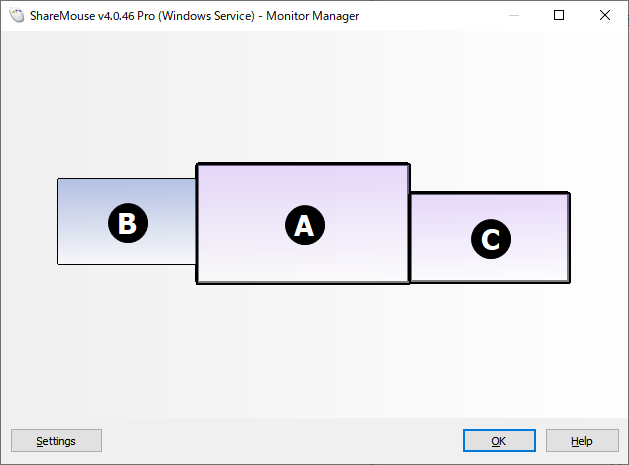

この2年ほど、C#関連の開発は、MacBookProのVMWare Fusion上のWindows10 + Visual Studio 2017でやってきましたが、そろそろ性能的に限界に近くなってきたので環境を刷新することにしました。

MBPも2016年モデルの15インチでCPUもGPUも当時最高性能のやつでメモリも16GB、VMWareには4コアメモリ8GB割り当てて、Visual StudioにはReSharperまで入れた状態でも全く問題なく開発作業ができてました。しかしこの2年で、VS2017もReSharperも機能が増えて結構重たくなった気がしますし、mac側でもいろいろ動かすようになってきたこともあるのか、作業中はマシンの負荷がずっと高いままで、VS2017を2つ動かしてデバッグを始めると、Windows側のキー入力もままならない状況になってきました。

Mac1台で両方とも使えるのは非常に便利で、環境を超えてのファイルやクリップボードの共有も便利だし、通信といってもホスト-ゲストなので速度もトラブルもまずないし、いいことずくめ(Windowsのゲームが遊べないって問題はありますけど……)です。なのでMacBookProを新調しようかとも考えたんですが、一番いいやつにしようとすると50万円ぐらいになってしまいます。まあ、もっと大きなお金を持って帰ってくるための道具なので多少高くてもしょうがないんですが、問題はその最高スペックを用意したとしても、仮想Windowsマシンに割り当てられるのはその半分な訳で、なんとなくすっきりしない……

mac買った当時は作業する場所が何カ所かあったので持ち運びできる作業環境が必須だったんですが、今はほぼ自宅のみでいけるようになったのでデスクトップでも問題ないし、出かけることになったらVMWare環境でもなんとかなる。その半分の予算でWindowsの実機を作った方が遙かに快適な環境が得られますね(ゲームもできるし……)。

で、CPUがi7 9700k、メモリ32GB、グラフィックはRTX2070、SSDが970EVO1TBなマシンを作りました。

一応プログラマなブログのつもりなので、ハードウェアはどうでもいいので、どうやってWindows+Macの作業環境を構築したか記録しておきます。  

## 操作環境

MacBookPro+モニタ2台のトリプルモニタの配置は換えず、そのままWindowsマシンにモニタをつなげ変えて、キーボードやマウス、USBハブなどの周辺機器もWindows側に接続します(Macだけ単体になる)。

で、Macの操作は[ShareMouse](http://www.keyboard-and-mouse-sharing.com/)を使います。

ShareMouseはネットワークを経由して、シームレスにキーボード/マウスを別端末で使えるようにするツールで、ファイルのドラッグドロップ、クリップボード共有にも対応していて、Windows-Mac間でも問題ありません。

BがMacで、AとCはWindowsです。Aの左にマウスを持って行くと、普通のマルチモニタと同じようにそのままマウス操作ができますし、キーボード入力もできます。これまでの操作感とほぼ変わらず使えます(思わずクセでMac側のウインドウをWindows側のモニタに引っ張ろうとして「えっ?」となるぐらいは自然です)。

※キー入力はMacのキーボードドライバを経由してないっぽいので、Karabiner-Elementsでやってるキーアサインとかが効きません  
※Free版もありますが機能が少ないので、少なくともStandard版を買うか、マルチモニタ環境だったらProが必要になります。

2台体制にしたときに、この部分が最大の懸念だったので、簡単に解決できてよかったです。デスクの上は、これまでと何の変更もありません。  
それどころか、macの左右のusbポートに生えていた各種ケーブルがなくなって電源一本になったのですごくすっきりしました。

## アプリケーション関連

macで使っていたVisual Studio CodeやSublime Textなどは、Windows版があるのでそれをインストール。WordやExcelはOffice365 Soloだったので、そのままWindows版をインストール、IllustratorもCC版なのでWindows版をインストール。

主要なアプリケーションは、WindowsもMacも両方あるし、わざわざWindows版に買い換えなくてよい、便利な世の中になりました。

他にも、[Postman](https://www.getpostman.com/)や[TeamSQL](https://teamsql.io/)を使ってますが、Windows版をダウンロードしてログインすれば、使っていた設定などが全部落ちてくるので移行の手間がありません。

## ランチャー

macではAlfred2を使っていましたが、[Keypirinha](http://keypirinha.com/)がほぼ同じ使用感で使えています。

## ターミナル

サーバーを触るのに何かと必要になってくるので、iTerm2と似たような感じのシンプルなものを、ということで、[Cmder](http://cmder.net/)にしてみました。

## その他

Slack、docker、Spark(メーラー)は当面macで。

## まとめ

今のところ移行して気になるのは、ブラウザで何か見るときのフォントの荒さと、時間見る時にどうしても画面の右上を探してしまうことぐらいです。