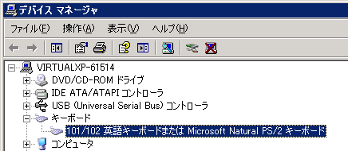
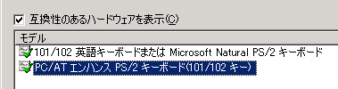

Windows 7のXP ModeでWindows XPを使っているのですが、使っているキーボードが英語キーボード、XPのデバイスマネージャでも「101/102英語キーボードまたはMicrosoft Natural PS/2キーボード」になっているにもかかわらず、入力が日本語キーボードになっていました。

<!--more-->

この場合は、「ドライバの更新」で「PC/AT エンハンス PS/2キーボード(101/102キー)」に変更。

再起動すればOKです。