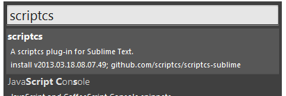
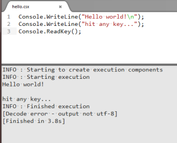

[Sublime Text 2](http://www.sublimetext.com/)のScriptCS用プラグインです。

Package Controlで「scriptcs」と検索するとインストールできます。

scriptcs.exeにパスを通しておけば、拡張子csxの時Ctrl+Bを押せば、コマンドプロンプトに切り替える必要なく、Sublime Text内で実行結果を表示してくれます。

開発は、GitHubの[https://github.com/scriptcs/scriptcs-sublime](https://github.com/scriptcs/scriptcs-sublime)で行われています。