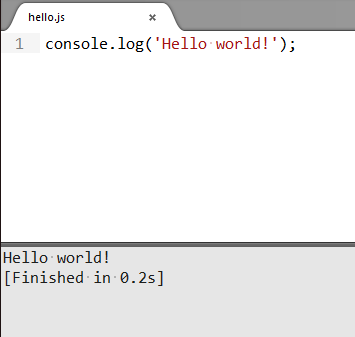

JavaScriptを扱っていると時々、一部のロジックや、ちょっとしたコードの動作を確かめたいときがあったりしますが、いちいちコードを書いてブラウザで確認するのはめんどくさいことがありますね。
まだまだJavaScriptに慣れないので、「こういう書き方は通るのか?」とか「この関数は何がどう返ってくるのか」とか気になることがあります。

そういうとき、Sublime Textだと、Ctrl+Bで動かせるので便利です。

やり方は、まずnode.jsをインストールしてパスを通しておきます。

その後、Sublime Textの[Tool]-[Build System]-[New Build System]を選んで、

    {
        "cmd": ["node","$file"]
    }

と入力してそのまま保存を選んで「JavaScript.sublime-build」という名前で保存しておきます。
そうすると、[Build System]の中にJavaScriptが出てくるので、それを選べば完了です。

node.jsで動くので、当然ブラウザに依存するようなものなどは動きませんが、事前に色々調べておいたりするのにはとても便利です。