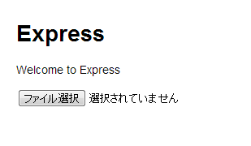
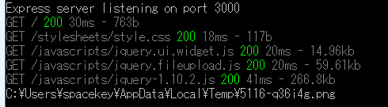
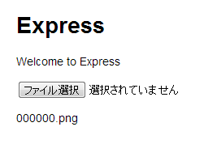
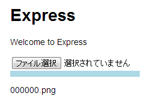

今作っているWebのアプリケーションで、ファイルのアップロードに[uploadify](http://www.uploadify.com/)というjQueryプラグインを使ってみたんですが、なんかSafariでうまく動いていないと言うことで、[jQuery-File-Upload](https://github.com/blueimp/jQuery-File-Upload)を使うことにしました。

uploadifyは、Flashを使っていたので若干抵抗があったのですが、シンプルな感じでプログレスバーも出ますし、扱いやすかったので良かった部分もあるのですが、まあしょうがない。色んなプラグインに通じてみると言うことで、jQuery-File-Uploadを使ってみました。

これがまた至れり尽くせりで豪華な代物で、ファイルアップロードに関して結構色んなことができるように作られています。
今のシステム的には、そこにあんまりこだわりすぎる必要もなく、さくっとアップロードできて、ちょっとずつ色々カスタマイズしていける方が望ましいので、まずは最低限の機能だけ使ってみます。
ちなみに、[How to use only the Basic plugin (minimal setup guide)](https://github.com/blueimp/jQuery-File-Upload/wiki/Basic-plugin)というページに基本機能の使い方が書いてありますが、これはサーバー側にプラグイン同梱のコードが必要になるので、これもちょっと今の状況ではオーバースペック気味なので、それすらも使わないという方法です。
サーバー側は、node.js+express.jsです。

### 下準備

まず、expressでサーバー側のひな形を作ります。

    mkdir upload
    cd upload
    express -e
    npm install

そして、プラグインの中から

*   jquery.fileupload.js
*   vendor\jquery.ui.widget.js
を取り出して、upload\public\javascriptsにコピーします。
同じところに、jQueryも入れておきます。

次に、upload\routes\index.jsに

    exports.upload = function(req, res) {
      console.log(req.files.file.path);
    };

と追記。

upload\app.jsのapp.get......の下に

    app.post('/upload', routes.upload);

と追記。

upload/view/index.ejsを

    <!DOCTYPE html>
    <html>
    <head>
     <title><%= title %></title>
     <link rel='stylesheet' href='/stylesheets/style.css' />
     
     
     
    </head>
    <body>
    <h1><%= title %></h1>
     
Welcome to <%= title %>

     <input id="fileupload" type="file" multiple="multiple" name="file" data-url="/upload" />
     
    </body>
    </html>

とこんな感じにします。

これで、

node app

でサーバー側を待機させて(色々試すときは、[node-supervisor](https://github.com/isaacs/node-supervisor)を使った方が便利です)、ブラウザでhttp://127.0.0.1:3000/を見てみますと、

こうなります。
そして、「ファイル選択」で何か一つファイルを選ぶと......

コンソールにこういう表示が出ると思います。
一応、ブラウザからはファイルが送信されています。

プラグインをこういう状態で動かすと、ファイルを選択したら即アップロードされるようですね。

お膳立てはこれで完了です。

### doneイベント(コールバック)

doneはファイルの送信のリクエストが完了したら呼ばれるものです。
サンプルのHTMLに書いてあるスクリプトには、doneの処理が書かれていますが、このままでは動きません。
まだサーバー側で何もレスポンスしてないので当たり前なんですが......

では、upload\routes\index.jsを書き換えます。

    exports.upload = function(req, res) {
      //console.log(req.files.file);

      var json = {
        files : [
          { name: req.files.file.originalFilename }
        ]
      };

      res.contentType('application/json');
      res.send(json);
    };

こうすると、クライアント側のdata.resultにこのJSONオブジェクトがセットされてきますので、きっとdoneが動くはずです。

出ましたね。

これで最低限のファイルアップロードの機能が使えるようになりました。
サーバー側であれこれ処理した結果をJSONに色々書き込んで返せばいいわけです。

### プログレスバー(progressコールバック)

upload/view/index.ejsの<input......>の下に、

    

と書いておいて、

    

も追記します。そして、JavaScriptの部分を

    $(function () {
      $('#fileupload').fileupload({
        dataType: 'json',
        done: function (e, data) {
          $.each(data.result.files, function (index, file) {
            $('
').text(file.name).appendTo(document.body);
          });
        },
        progress: function (e, data) {
          var progress = parseInt(data.loaded / data.total * 25, 10);
          $('#progress .bar').css('width', progress + '%');
        }
      });
    });

という感じで、progressの部分を追加しましょう。

そうすると、こんな感じでプログレスバーを表示することができます。
ローカルでやると、結構大きなファイルじゃないと伸びてるのが見えませんけど......

あと他にも[Options#CallbackOptions](https://github.com/blueimp/jQuery-File-Upload/wiki/Options#callback-options)にあるコールバックをこねくり回すと色んなことができますね。
[ｊQuery File Uploadの使い方](http://ocyadouzo.blogspot.com/2013/06/jquery-file-upload.html)は解説を日本語訳してくれていますので、要点をつかむのにはいいと思います。