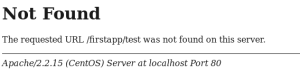

では、ベースになる環境ができたので、Slim Frameworkを使ってみます。
/var/www/html以下に、「firstapp」というフォルダを作成して、ここをプロジェクトのディレクトリとして作業します。

#### Slim Frameworkのインストール

Composerでインストールします。

composer.jsonの内容を下記の通りにします。

    {
        "require": {
            "slim/slim": "2.*"
        }
    }

インストールします。

    composer install

そうすると、vendorディレクトリが作成されます。

    firstapp/
        composer.json
        composer.lock
        vendor/
            autoload.php
            composer/
            slim/

現時点ではこういうディレクトリ構造になっているはずです。

#### .htaccessを作成

firstappディレクトリに、下記の通りの.htaccessファイルを作成します。

    RewriteEngine On
    RewriteBase /firstapp/
    RewriteCond %{REQUEST_FILENAME} !-f
    RewriteRule ^(.*)$ index.php [QSA,L]

firstappディレクトリ以下を要求するURLはすべて/firstapp/index.phpが呼び出されるようにする設定です。
要求に対してはすべてindex.phpがいったん受理して、それぞれの処理をしてレスポンスを返す、と言うアプリケーションの作り方をするわけです。

#### index.php

では、実際にやってみましょう。
firstapp/index.phpを作成します。

    <?php
    require_once 'vendor/autoload.php';

    $app = new Slim\Slim();

    $app->get('/', function () {
        echo "Hello world!";
    });

    $app->run();

書くのはこれだけです。

*   autoload.phpでComposerでインストールしたコンポーネントがロードされる
*   Slimオブジェクトを生成
*   GETで/にアクセスがあったら、「Hello world!」と出力する
*   アプリケーションを起動
と言うことをやっています。
これで、ブラウザからhttp://localhost/firstapp/を見てみると、「Hello world!」が表示されるはずです。
表示されたら、試しにhttp://localhost/firstapp/testとかを指定してみてください。そうすると、Apacheのではない404メッセージが表示されると思います。

これは、Slimが指定されたURLのルーティングができなかった場合の404です。

もしApacheの404が表示された場合は、.htaccessがないかおかしい、もしくはhttpd.confでAllowOverride Allができてないのだと思われます。

#### ルーティングを追加

では、http://localhost/firstapp/testと指定された場合の処理を追加します。

    <?php
    require_once 'vendor/autoload.php';

    $app = new Slim\Slim();

    $app->get('/', function () {
        echo "Hello world!";
    });

    $app->get('/test', function () {
        echo "test";
    });

    $app->run();

GETで/testが来たら、testと表示する......これだけです。

#### 変数として取得

ブログなんかだと、http://localhost/test/999という指定で特定の記事を呼び出すことができます。

    $app->get('/test/:id', function ($id) {
        echo "test:$id";
    });

:idという形で指定すると、$idで呼び出す関数の引数として渡せますので、指定された数値に従ったレスポンスを返せば良いでしょう。

他にも、

    $app->get('/param/:one/:two', function ($one, $two) {
        echo "param:$one and $two";
    });

こんなことや、

    $app->get('/wildcard/:params+', function ($params) {
    	foreach ($params as $param)
    		echo "wildcard:$param ";
    });

こんな風にワイルドカード的なルーティングもできます。
このコードで、http://localhost/firstapp/wildcard/a/b/c/dという指定をすると

    wildcard:a
    wildcard:b
    wildcard:c
    wildcard:d

となります。

#### QueryParameterを取得

    $app->get('/query', function() use($app) {
    	$queryid = $app->request->get('queryid');
    	echo "query: $queryid";
    });

http://localhost/query?queryid=999のようなパラメータは、$app->request->get('hoge')で取得できます。
コールバック関数で$appを使う場合は、関数名(引数)のあとに「use($app)」をつければ使えるようになります。

GET関連はこれだけできれば十分何とかなりますね。