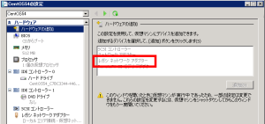

CentOS5.4環境が必要になり、Hyper-Vに仮想マシンを作って動かそうとしたらeth0が起動しませんでした。

仮想マシンを作成したときに、デフォルトで指定されるネットワークアダプタだとドライバが合っていなくてだめなようです。
仮想マシンの設定を開けて、デフォルトで指定されるネットワークアダプタを削除し、「ハードウェアの追加」で「レガシネットワークアダプタ」を追加すると動くようになります。

