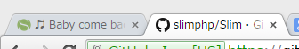

PHPのマイクロフレームワーク、[Slim Framework](http://www.slimframework.com/)(http://www.slimframework.com/)が2.6にアップデートしていました。  
3/1に2.6.0がリリースされてから、3/9に2.6.2になっていますね。

2.6.0は、

*   SessionCookie.phpの脆弱性修正
*   新しいHTTPステータスコードの追加
*   Google App Engine用のHTTPリクエストの何か
*   URIパースの改善
*   色々改善

2.6.2は、

*   CookieデータのJSONデコードテストの更新
*   READMEファイルにビルドステータス
*   PrettyExceptionsのメッセージとスタックトレースのHTMLエスケープ

と言うことです。  
まだ具体的に見てないので何が変わったかわかりません。

でも定期的にメンテナンスされているのでいいですね。  
マイクロフレームワークですから、あまり作法を覚えなくても基本的なことができますし、規模が大きくなければ見通しも良くていいフレームワークだと思うんですけど、日本ではあまり使われてないんでしょうかね。

2/11のニュースで、[What's up with version 3.0?](http://www.slimframework.com/2015/02/11/whats-up-with-version-3.html)とかあるんですが、Slim 3.xがでるんですかね？この辺も辞書と仲良くしながらちょっとずつ読んでみたいです。

あと、ブラウザのタブを行ったり来たりしながら読んでいたら......

何か、Slimのホームページを開いているタブがうたっているのに気がつきました(笑)

> ♬ Baby come back! Any kind of fool could see... ♬

PlayerのBaby Come Backという歌らしいです。すいません、知りません。  
タブをアクティブにすると、ちゃんと元のタイトルに戻ります。ブラウザからフォーカスが外れてもこうなるので、フォーカスがなくなると変わるようになってるんですね。なんとまあ芸の細かい。